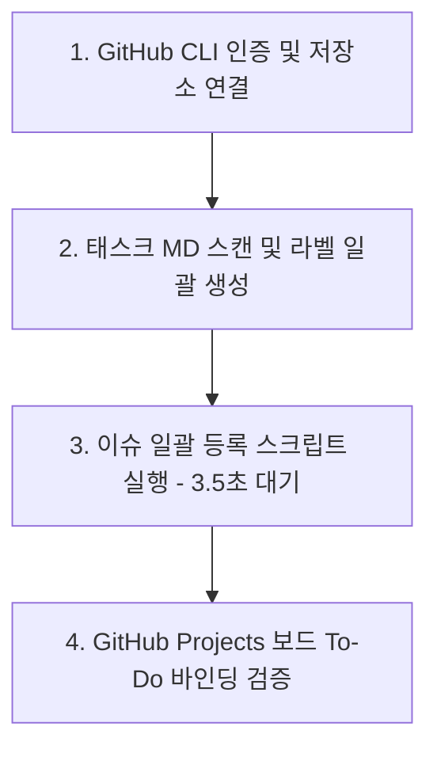

# [Guide] 66개 Task Markdown의 GitHub Issues & Projects 일괄 등록 및 사전 준비 사항

> **작성자**: AI 동료 다온  
> **대상**: 회비서 (사업기획 및 프로젝트 총괄)  
> **관점**: 기술적 현실성(상식), 시스템 사고(지능), 오케스트레이션(업무 방식)

---

## 1. 핵심 요약 (Core Summary)

현재 `tasks/` 디렉토리에 위치한 **66개의 MD 파일**은 모두 상단에 YAML Frontmatter(`title`, `labels`, `assignees`)를 포함하고 있어 **완벽한 구조화(Structured Specification)** 상태입니다. 
하지만 이를 수동으로 등록하거나 단순 복구(Copy&Paste)하는 것은 비효율적이며 유지보수에 취약합니다. 

따라서 **GitHub CLI (`gh`)와 자동화 스크립트(Python/PowerShell)**를 연계하여 일괄 파싱 및 등록하는 방식을 권장합니다. 이를 실행하기 전, GitHub 상에서 **라벨(Labels) 체계 구축**, **Projects 보드 생성 및 워크플로우 연동**, **API Rate Limit 방지 방안**이 우선 준비되어야 합니다.

---

## 2. GitHub 사전 준비 사항 (Checklist)

### ① GitHub Repository (저장소) 셋업
1. **GitHub CLI (`gh`) 인증**
   - 로컬 터미널에서 `gh auth login`을 실행하여, 저장소에 대한 쓰기/이슈 관리 권한이 있는 계정으로 인증이 완료되어 있어야 합니다.
2. **라벨(Labels) 사전 정의 및 색상 맵핑**
   - 태스크 문서들의 Frontmatter에 기입된 라벨(`feature`, `backend`, `frontend`, `priority:high`, `db`, `mock` 등)을 사전에 등록해야 합니다.
   - 존재하지 않는 라벨을 `gh issue create` 시 호출하면 오류가 발생하거나 시인성 없는 기본 색상으로 생성되므로, **프로젝트 라벨 딕셔너리**를 선언하고 일괄 생성해 둬야 합니다.
3. **Assignees(담당자) 가입 여부**
   - 스크립트로 담당자(Assignee)를 자동 배정하려면, 대상 ID가 반드시 저장소의 Member 혹은 Collaborator로 수락된 상태여야 합니다. 현재 공백(`assignees: ''`)인 파일들은 미지정 처리됩니다.

### ② GitHub Projects (V2/Beta) 셋업
1. **새로운 Projects 보드 생성 (Kanban / Table view)**
   - Organization 또는 계정 레벨에서 Project를 만들고 대상 Repository를 연결(Link)합니다.
2. **내장 자동화 워크플로우(Built-in Automations) 활성화**
   - Projects 보드 설정(Workflow)에서 **"Item added to basic repository -> automatically set status to 'To do'"** 규칙을 활성화합니다.
   - 이 규칙이 활성화되어 있어야, 스크립트가 이슈를 발급했을 때 별도의 Project 연계 명령 없이도 **자동으로 보드 'To do' 열에 카드들이 차곡차곡 쌓이게 됩니다**. (또는 GitHub Action / `gh project item-add`를 이용한 자동화 병행 가능)

---

## 3. 기술적 현실성 & 리스크 분석 (숨은 전제와 한계)

### ① YAML Frontmatter 제거 및 파싱 필요성
- **문제점**: MD 파일을 그대로 이슈 본문(Body)에 통째로 넣으면 맨 위의 `--- name: Feature Task ... ---` 메타데이터 영역까지 텍스트로 표출됩니다.
- **해결 방안**: 등록 스크립트에서 **YAML Frontmatter를 파싱하여 `title`, `labels` 값을 추출**하고, 본문 전장(Body)에는 메타데이터 구역을 제거한 **순수 Markdown 본문**만 전송하도록 구조화해야 합니다.

### ② GitHub API 어뷰징 제재 (Abuse Rate Limit) 대응
- **문제점**: 66개의 이슈를 딜레이 없이 루프(Loop) 문으로 연달아 등록(POST)할 경우, GitHub DDoS/Abuse 차단 로직에 의해 API 차단 또는 실패가 발생합니다.
- **해결 방안**: 자동화 스크립트 루프 구문 사이에 반드시 **3~5초의 대기 시간(`sleep 4`)**을 부여하여 안전하게 등록되도록 오케스트레이션해야 합니다.

### ③ Task ID(예: ANA-CMD-01)와 Issue 번호(예: #12) 불치 리스크
- **숨은 전제**: MD 문서 본문의 "Dependencies: Depends on SCAN-CMD-01" 라는 문구는 자동 링크(Hyperlink)가 걸리지 않습니다. GitHub는 `#이슈번호` 문법으로만 연관 이슈를 연동합니다.
- **판단 기준**:
  - **현재 단계(권장)**: 문서 내 식별자(Task ID)를 텍스트로 그대로 유지하되, 전체 이슈 제목에 `[ANA-CMD-01]`과 같은 고유 접두사를 유지하게 하므로 눈으로 매핑하는 데 무리가 없습니다.
  - **추가 개선 단계**: 스크립트 실행 후 `[Task_ID : Github_Issue_Number]` 쌍을 JSON 매핑 테이블로 기록해 두고, 2차 파이썬 스크립트를 통해 본문 속 식별자를 `#번호` 모양으로 일괄 Update(치환)하는 것도 가능합니다.

---

## 4. 실행 로드맵 (Actionable Step-by-Step)

회비서님께서 승인하신다면, 다음과 같은 순서로 등록 파이프라인을 구동할 수 있습니다.

### [Step 1] 터미널 인증 및 환경 준비
- `gh auth status` 로 올바른 계정 및 저장소 연결 상태 확인

### [Step 2] 라벨(Label) 등록 및 Project 보드 셋업
- 66개 파일에 분포한 `feature`, `backend`, `frontend`, `priority:high` 등 라벨셋 생성.

### [Step 3] 자동화 파싱 & 이슈 등록 스크립트 (다온이 제공 가능)
- Python 또는 PowerShell 스크립트를 작성하여 66개 MD 파일을 순차 가공하고 `gh issue create`를 호출.

---

> :bulb: **의사결정 요청**:  
> 위 가이드에 따라 GitHub Repository와 Projects 보드를 준비해 주시면, 제가 **① 전체 MD에서 라벨을 정렬하여 자동 생성하는 커맨드**와 **② YAML 메타데이터를 분리해 3초 간격으로 안전하게 이슈를 등록하는 스크립트**를 작성해 즉시 실행해 드릴 수 있습니다. 진행하시겠습니까?
