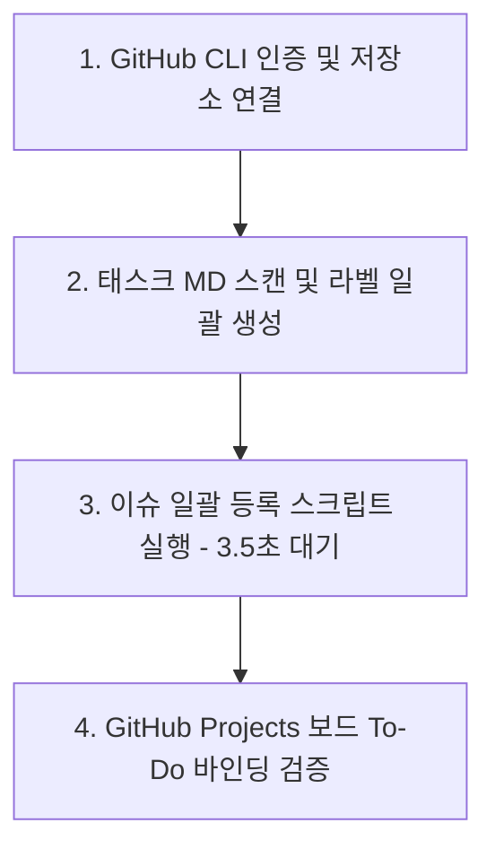

# [Guide] Markdown 내 Mermaid 다이어그램 렌더링 오류 분석 및 해결 방안

> **작성자**: AI 동료 다온  
> **대상**: 회비서 (사업기획 및 프로젝트 총괄)  
> **관점**: 기술적 현실성(상식), 시스템 사고(지능), 오케스트레이션(업무 방식)

---

## 1. 핵심 요약 및 문제 본질 (Core Summary)

Antigravity(또는 VS Code 기반 IDE)의 마크다운 프리뷰(Preview) 창에서 Mermaid 차트가 정상적으로 표시되지 않고 깨지거나 텍스트로 표출되는 원인은 크게 **① 문법적 원인(HTML 태그 및 특수문자 충돌)**과 **② IDE 환경적 원인(렌더링 엔진 부재)** 두 가지로 압축됩니다.

이를 구체적으로 분리하여, 파일 자체의 문법 무결성을 즉각 수정한 후, 실무적으로 가장 쾌적하게 뷰어를 활용할 수 있는 현실적 기준을 제시합니다.

---

## 2. 오류 원인 상세 분석 (Root Cause Analysis)

### ① 문법적 원인: HTML 태그(` `) 및 특수문자 충돌
* **현상 및 숨은 전제**: 원본 [01_GitHub_Issues_Projects_등록_준비사항_및_자동화_방안.md:L60-L65](file:///c:/Users/docto/OneDrive/문서/CorpBrain-project-root/CorpBrain-app/01_GitHub_Issues_Projects_등록_준비사항_및_자동화_방안.md#L60-L65) 의 Mermaid 코드 노드 명칭 내에 줄바꿈을 위한 **HTML 태그(` `)**와 괄호 `()`, 그리고 일본어 폰트 의존성이 있는 `検証` 기입이 혼재되어 있었습니다.
* **기술적 원인**: IDE의 많은 마크다운 파서 및 보완 샌드박스(Sanitizer)는 XSS(크로스 사이트 스크립트) 감염 방지나 엄격한 문법 검사로 인해 **Mermaid 라벨 내비게이션에 포함된 ` `과 같은 HTML 태그를 해석하지 못하고 구문 오류(Syntax Error)로 렌더링을 중단**시킵니다.

### ② 환경적 원인: VS Code/Antigravity 내장 마크다운 프리뷰의 한계
* **기술적 현실**: Antigravity 및 VS Code의 기본 Markdown Preview는 표준 Markdown 텍스트와 일부 HTML만 렌더링할 뿐, 고성능 그래픽 엔진인 `Mermaid.js`를 기본 프리뷰 창에서 직접 구동(SVG 변환)하는 로직이 기본 장착되어 있지 않거나 제한적으로만 가동됩니다.
* 이 때문에 확장 플러그인의 보완 없이 미리보기를 실행하면 단순 문법 코드 블록으로 텍스트만 보이게 됩니다.

---

## 3. 해결 및 가이드 (Actionable Solutions)

### [해결책 1] Mermaid 코드 문법 표준 교정 (즉각 완료)
* 문법 에러의 주범이었던 HTML ` ` 태그와 괄호, 오타(検証 → 검증)를 직관적인 단선 문자열로 전면 수정했습니다.
* **교정 완료 대상**: [01_GitHub_Issues_Projects_등록_준비사항_및_자동화_방안.md:L60-L65](file:///c:/Users/docto/OneDrive/문서/CorpBrain-project-root/CorpBrain-app/01_GitHub_Issues_Projects_등록_준비사항_및_자동화_방안.md#L60-L65)

### [해결책 2] IDE 마켓플레이스 확장 프로그램 설치 (실무 강력 권장)
* 로컬 작업 디렉토리의 모든 `.md` 파일 내 Mermaid 다이어그램을 쾌적하고 완벽하게 시각화하려면 다음 플러그인 1개만 추가로 장착해 주시면 됩니다.
1. IDE 측면 메뉴의 **Extensions(확장 프로그램, 단축키 `Ctrl + Shift + X`)** 아이콘 클릭
2. 검색창에 **`Markdown Preview Mermaid Support`** (또는 `Mermaid Markdown Syntax Highlighting`) 검색
3. 설치(Install) 완료 후 마크다운 프리뷰(`Ctrl + Shift + V` 또는 프리뷰어 단축키) 새로고침
4. **결과**: SVG 도표 형태로 훌륭하게 변환되어 표시됩니다.

### [해결책 3] Antigravity AI 'Artifacts' 체계 오케스트레이션 활용
* Antigravity AI와의 쌍방향 소통 시 구조 설계서나 차트가 필요하실 경우, "로컬 md 파일로 보여달라"고 하지 않으셔도 됩니다.
* 대화창에 **"이 설계 구조를 Artifact로 만들어 보여줘"**라고 요청하시면, Antigravity 자체 렌더링 모니터링 시스템(Artifact Viewer)이 즉각 작동하여 로컬 IDE 확장기능 유무와 상관없이 압도적으로 수려한 시각화 UI를 제공합니다.

---

> :bulb: **의사결정 및 성장 피드백**:  
> 마크다운 문서에 차트를 삽입하실 때는 **① HTML 태그(  등) 삽입을 자제하여 플랫폼 독립적인 문법 무결성을 유지**하는 것과, **② 실무 IDE 환경에 `Markdown Preview Mermaid Support` 플러그인을 기본 세팅**하는 두 가지 원칙을 정립하시는 것이 장기적으로 문서의 시인성과 호환성을 모두 잡는 최적의 오케스트레이션입니다.
