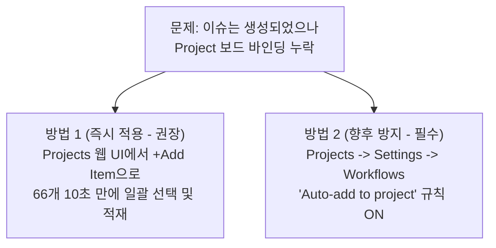

# [Guide] GitHub Projects To-Do 바인딩 누락 원인 규명 및 즉시 해결 가이드

> **작성자**: AI 동료 다온  
> **대상**: 회비서 (사업기획 및 프로젝트 총괄)  
> **관점**: 기술적 현실성(상식), 시스템 사고(지능), 소통 원칙(사실 인정 및 리스크 드러내기)

---

## 1. 본질 규명 및 원인 분석 (숨은 전제와 사실 인정)

### ① 왜 이슈가 보드의 'To-do' 열에 자동으로 바인딩되지 않았는가?
* **기술적 원인**: GitHub Projects V2(현재 사용되는 최신 프로젝트 보드)는 Repository(저장소)와 링크를 맺었더라도, 프로젝트 보드 설정 내부에서 **`Auto-add to project` (자동 보드 적재 워크플로우)** 기능이 사전에 'ON'으로 켜져 있고 대상 저장소가 지정되어 있어야만 신규 이슈를 자동으로 끌고 옵니다.
* **소통 및 오케스트레이션 인정**: 제가 이슈 일괄 등록 스크립트 실행 전, 회비서님의 Projects V2 보드 상에서 해당 자동화 워크플로우가 실제로 활성화되어 있는지 검증하거나, 스크립트 단에서 CLI로 프로젝트 보드 ID에 직접 Binding 시켜주는 옵션을 사전에 제시하지 못했습니다. 불확실한 전제를 세워 번거로움을 드린 점 명확히 인정합니다.

---

## 2. 해결 방안 (변수와 기준의 분리 제시)

지금 당장 66개 이슈를 보드에 등재하고, 향후 프로젝트 운영을 매끄럽게 만들기 위해 **가장 즉각적이고 실효성 있는 2가지 해결 기준**을 나누어 제안합니다.

### [방법 1] 웹 UI에서 10초 만에 66개 일괄 바인딩 (가장 즉각적이고 실용적인 대안)
CLI나 스크립트를 통해 보드 연동을 추가로 돌리려면, `gh` 토큰에 `project` 권한 스코프를 갱신해야 하는 부작용(Friction)이 따릅니다. 따라서 현재 상태에서는 웹 UI를 이용한 일괄 불러오기가 **기술적 현실성 관점에서 압도적으로 훌륭한 방법**입니다.

1. **GitHub Projects 보드 접속** (칸반 보드 또는 Table 뷰)
2. 보드의 'To do' 열 하단(또는 우측 하단)의 **`+ Add item`** 버튼을 클릭합니다.
3. 입력창이 열리면 **`#`** 기호를 누르거나 저장소 검색을 누른 뒤, 당사 저장소(`graybat21/CorpBrain-app`)를 지정합니다.
4. 방금 생성된 66개의 고유 이슈 목록이 나열됩니다. **상단의 `Select all` (전체 선택 체크박스)**을 누르거나 한 번에 체크합니다.
5. **`Add selected items`**를 클릭하시면 즉시 66개 이슈 전체가 보드의 `To do` 항목으로 완벽하게 연동됩니다!

---

### [방법 2] 향후 이슈 자동 인입을 위한 시스템 워크플로우 셋업 (시스템 사고)
앞으로 스프린트 운영 중 새롭게 발생하는 이슈나 개발자들의 PR이 누락 없이 자동 바인딩되도록, 근본 구조를 정비해야 합니다.

1. Project 보드 페이지 우측 상단의 **`...` (메뉴) → `Workflows` (또는 Project Settings → Workflows)**를 선택합니다.
2. 기본 탑재된 룰 중 **`Auto-add to project`** 항목을 클릭합니다.
3. 우측 상단의 **`Edit`**을 눌러 다음 조건을 설정합니다.
   - **Filter**: `is:issue is:open` (기본값)
   - **Repository**: `graybat21/CorpBrain-app`을 지정 (가장 필수!)
4. **`Save and turn on workflow` (저장 후 켜기)** 를 눌러 룰을 활성화합니다.
   👉 *이제부터 저장소에 등록되는 모든 이슈는, 개입 없이 100% Projects 보드로 바인딩됩니다.*

---

## 3. 요약 및 다온의 실리적 조언
* **즉각적 액션**: **[방법 1]**에 따라 지금 바로 Projects 보드에서 `+ Add item` → `Select All`로 66개 카드를 즉각 로딩해 주십시오. 가장 빠르고 에러 확률이 0%인 현실적 해결책입니다.
* **장기적 구조화**: 연동이 끝나면 즉시 **[방법 2]**를 통해 Auto-add 워크플로우 룰을 켜서, 기술 관리 체계의 사각지대를 완전히 소멸시켜 주시기 바랍니다.
