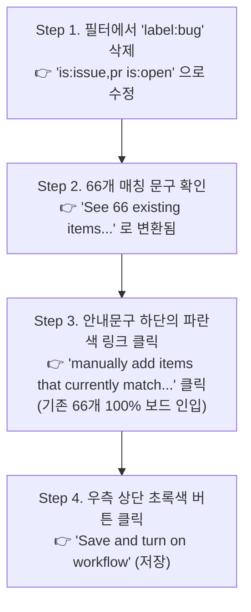

# [Diagnosis] GitHub Projects Auto-add Workflow 필터 설정 분석 및 해결안

> **작성자**: AI 동료 다온  
> **대상**: 회비서 (사업기획 및 프로젝트 총괄)  
> **관점**: 기술적 현실성(상식), 시스템 사고(지능), 본질 중심 분석

---

## 1. 스크린샷 정밀 진단 (핵심 원인)

회비서님께서 공유해주신 Auto-add to project 설정 화면을 검토한 결과, **이슈가 바인딩되지 않은 결정적인 원인이 Filters(검색 필터 조건)에 있음**을 명확히 확인했습니다.

### 🚫 결정적 원인: `label:bug` 필터 조건의 차단
* **현재 화면의 Filter 설정값**:  
  `is:issue,pr is:open label:bug`
* **기술적 맹점 및 숨은 전제**:  
  이번에 일괄 발급한 66개의 이슈들은 기획 및 기능 구현을 위한 `feature`, `test`, `backend`, `frontend`, `db` 등의 라벨로 구성되어 있으며, **`bug`(버그) 라벨을 가진 이슈는 단 하나도 없습니다.**
* **진단 결론**:  
  끝에 붙은 `label:bug`라는 제한 조건 때문에 GitHub이 전체 이슈 66건을 모두 배제하고, 화면 중단에 **`See 0 existing items that match this query`**(이 쿼리와 일치하는 기존 항목 0개)라고 출력한 것입니다.

---

## 2. 해결 및 66개 즉시 연동 조치 (Action Plan)

현재 열어두신 그 화면에서 **다음 3가지 조치**만 순서대로 수행하시면 모든 이슈가 보드로 즉시 적재됩니다.

### [Step 1] Filters 조건 텍스트 수정 (제한 풀기)
검색 필터 입력창 끝에 적혀있는 **`label:bug`를 백스페이스로 완전히 지워버립니다.**
* **수정 후 목표 문자열**: `is:issue,pr is:open` (또는 더 간결하게 `is:issue is:open`)
* 텍스트를 지우는 즉시 아래의 0개 매칭 문구가 **`See 66 existing items that match this query` (66개 항목 일치)** 로 실시간 변환됩니다.

### [Step 2] ★ 기존 66개 항목 즉시 일괄 바인딩 (하이퍼링크 클릭)
GitHub Auto-add 룰은 '저장 이후 생성될 신규 이슈'부터 자동 동작하는 것이 원칙이나, 해당 화면에서 기존 일치 항목을 한 번에 당겨올 수 있는 내장 링크를 제공하고 있습니다.

* 화면 본문 설명 텍스트 끝 부분에 적힌 **`You can also manually add items that currently match your filter ↗`** (현재 필터에 일치하는 항목을 수동으로 추가) 라는 파란색 링크를 클릭하십시오.
* 이 링크를 누르는 순간 **현재 매칭된 66개의 이슈 전량이 단번에 Projects 보드로 빨려 들어갑니다!**

### [Step 3] 워크플로우 활성화 저장
마지막으로 화면 우측 상단의 초록색 버튼 **`Save and turn on workflow`**를 누르시면 완결됩니다.

---

## 3. 다온의 핵심 피드백
필터 조건 하나(`label:bug`)가 오케스트레이션 전체를 막고 있었던 대표적 사례입니다.  
**지금 바로 `label:bug` 단어를 지우시고 66개 항목이 매칭되는 것을 눈으로 확인하신 뒤, 설명글의 파란색 링크를 눌러 단숨에 바인딩을 완료해 주십시오.**
