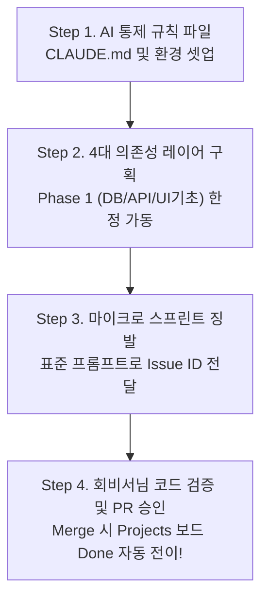

# [Master Plan] Claude Code 기반 AI 자율 코딩 개발 오케스트레이션 전략

> **작성자**: AI 동료 다온  
> **대상**: 회비서 (사업기획 및 프로젝트 총괄)  
> **관점**: 기술적 현실성(상식), 시스템 사고(지능), 오케스트레이션(업무 방식), 리스크 분리

---

## 1. 핵심 요약 및 숨은 전제 (Technical Realism & Risks)

클로드코드(Claude Code) 등 최신 자율형 AI 에이전트를 실무 투입할 때, **"66개 이슈를 알아서 분석해서 우선순위대로 맘대로 개발해 줘"라고 막연히 자율성을 방임하면 거대한 기술적 부채와 실패에 직면합니다.**

### 🚫 왜 자율성 방임이 위험한가? (숨은 전제)
* **의존성 트랩 (Dependency Mismatch)**: 데이터베이스 스키마와 API 계약(DTO)이 미성숙한 상태에서, AI가 자율적으로 통계 차트 UI(#50)나 문서 파일명 변경 로직(#38)을 건드릴 경우, 기반 코드가 바뀔 때마다 기존 코드가 무너지며 엉망이 됩니다.
* **컨텍스트 오염 및 허클베리 피노키오 현상**: 한 번에 너무 넓은 과업(66개)을 인지시키면 AI는 컨텍스트 윈도우 한계를 초과하거나 엉뚱한 방향으로 Mock 코드를 남발하는 오작동을 보입니다.

### 💡 오케스트레이션(업무 방식)의 본질
회비서님의 역할은 직접 코딩을 하는 것이 아니라, **AI 에이전트가 완벽하게 실력을 발휘할 수 있는 통제된 레이어(Phases)를 구획하고, 명확한 Git Flow와 룰셋(Convention)을 배치하는 총괄 지휘관(Orchestrator)**이 되는 것입니다.

---

## 2. 4단계 개발 오케스트레이션 마스터 로드맵



### Step 1. AI 통제 규약 및 헌정 문서 (`CLAUDE.md`) 생성
Claude Code CLI가 프로젝트의 문맥과 원칙을 해치지 않고 100% 능력을 내도록, 프로젝트 루트에 **`CLAUDE.md`** 라는 규칙 문서를 미리 작성해 두어야 합니다.
* **필수 룰셋**:
  1. **Git Flow Rules**: "절대 `main` 브랜치에 직접 수정하거나 push 하지 말 것! 반드시 `feature/issue-<번호>-<약어>` 브랜치를 생성하여 개발할 것."
  2. **GitHub CLI 규약**: "이슈 명세 확인은 `gh issue view <ID>`를 이용하고, 개발 완료 시 반드시 `gh pr create --title '... Closes #ID'` 형태로 Pull Request를 제출할 것."
  3. **DoD (Definition of Done) 원칙**: "코드 작성 후 본문의 Acceptance Criteria와 단위 테스트 시나리오를 자발적으로 검증(Test Run)할 것."

---

### Step 2. 66개 태스크의 4대 의존성 마이그레이션 단계 (Phases)
66개의 태스크를 의존성 트리(DAG)의 뿌리부터 가지로 **단 4개의 레이어**로 해체했습니다. AI에게 66개를 주지 마시고, **반드시 Phase 별로 단절시켜 지시**해야 합니다.

#### 🔥 [Phase 1] Core Foundation & Contracts (기공식: DB·API·UI뼈대)
*모든 상위 도메인과 로직이 딛고 설 든든한 반석입니다. 이 과목들이 끝나지 않으면 다른 기능은 손도 댈 수 없습니다.*
* **데이터 및 인프라 코어**:
  - **`DB-001` (#15)**: SQLite `corpbrain_meta.db` 스키마 생성 및 마이그레이션
  - **`DB-002` (#16)**: ChromaDB / FAISS 벡터 DB 컬렉션 초기화
  - **`INF-CMD-01` (#23)**: Windows MAX_PATH 초과 및 권한 거부 글로벌 예외 처리
  - **`INF-CMD-02` (#24)**: 로그 파일 로테이션 (50MB/30일) 및 Config 포팅
* **데이터 교양 및 계약(Contracts)**:
  - **`API-001` (#11)**: Workspace 도메인 Request/Response DTO 정의
  - **`API-002` (#12)**: Analysis 도메인 Request/Response DTO 정의
  - **`API-003` (#13)**: LLM, Rename, Watcher, Analytics DTO 정의
* **프론트엔드 및 병행 Mock 기반**:
  - **`APP-UI-01` (#14)**: 전체 앱 레이아웃 및 디자인 시스템 기초 공사
  - **`MOCK-001` (#35)**: 프론트엔드 독립 개발용 Workspace/대시보드 Mock 서버
  - **`MOCK-002` (#36)**: 심층 분석 결과 및 Rename Diff 반환 Mock 서버

#### 🏗️ [Phase 2] Core Domain Command Engines (핵심 비즈니스 로직)
* **Workspace & Scan**: `WS-CMD-01` (#61), `SCAN-CMD-01~02` (#44, #45)
* **Analysis & LLM**: `ANA-CMD-01~03` (#1~#3), `LLM-CMD-01~03` (#27~#29), `DL-CMD-01~02` (#17, #18)
* **Rename & Watcher & Stat**: `RN-CMD-01~03` (#37~#39), `WA-CMD-01~03` (#53~#55), `STAT-CMD-01` (#49)

#### 🎨 [Phase 3] Query APIs & Frontend Binding (화면 구현 및 바인딩)
* 각 기능별 조회 쿼리(`*-QRY-*`) 및 렌더링 UI(`*-FE-*`, #4, #5, #19, #40, #50, #56, #62 등)

#### 🧪 [Phase 4] Quality Assurance & Hardening (통합 TC 검증)
* 성능 부하 테스트 및 예외 테스트(`*-TEST-*`, #9, #22, #25, #26, #33 등)

---

### Step 3. Claude Code 전용 실무 오케스트레이션 프롬프트 템플릿
이제 Phase 1을 시작하실 때, 터미널(또는 Claude Code 입력창)에 아래 프롬프트를 헌정하시면 가장 우아한 자율 코딩 파이프라인이 전개됩니다.

```text
우리는 CorpBrain-app 프로젝트의 [Phase 1: Core Foundation & Contracts] 마이크로 스프린트를 시작한다.
금일 네가 달성해야 할 후보 이슈 리스트는 다음과 같다:
[#15(DB-001), #16(DB-002), #11(API-001), #12(API-002), #13(API-003), #23(INF-CMD-01), #24(INF-CMD-02), #14(APP-UI-01), #35(MOCK-001), #36(MOCK-002)]

1. 프로젝트 규칙(CLAUDE.md 또는 대화 전제)을 100% 준수하라.
2. 위 대상 중 모든 데이터 및 연동의 최하부인 DB 스키마(#15)와 API 계약(#11~13)을 1차 순위로 스스로 결정하여 작업을 개시하라.
3. 각 태스크를 작업할 때는 반드시 `gh issue view <이슈번호>` 로 요구사항과 Acceptance Criteria, DoD를 정밀 분석하라.
4. `main`에 작업하지 말고, 반드시 `feature/issue-<번호>-<약어>` 형태의 신규 브랜치에서 구현하라.
5. 로컬에서 코드와 검증 테스트를 통과시킨 후, `gh pr create --title "[Phase 1] Closes #번호: <이슈 제목>"` 로 PR을 생성하고 나에게 승인을 요청하라.
```

---

## 3. 요약 및 다온의 액션 제안 (What to do right now)

회비서님께서 진정한 기술 지위관으로서 첫걸음을 떼시기 위한 **지금 당장 2단계 실천 방안**을 권장합니다.

1. **`CLAUDE.md` (AI 행동 지침서) 세팅**: AI가 Git 브랜치 전략이나 PR 생성 문법, 커밋 컨벤션을 안 어기도록 제가 즉시 완벽한 **`CLAUDE.md`** 파일을 작성해 드리겠습니다. (진행 원하시면 말씀해 주십시오)
2. **Phase 1 첫 작업 징발**: 제가 작성해 드린 프롬프트 템플릿 중 **Phase 1 이슈 번호들(#15, #11 등)**을 기반으로 Claude Code에게 첫 지시를 안겨보십시오. 놀랄 만큼 정확한 순서로 PR이 하나씩 배포되는 쾌감을 보시게 될 것입니다.
