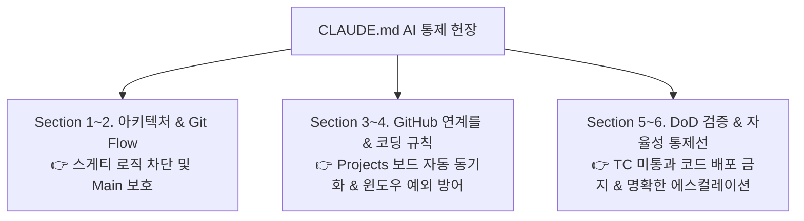

# [Guide] CLAUDE.md 설정 내역 및 항목별 설계 근거 보고서

> **작성자**: AI 동료 다온  
> **대상**: 회비서 (사업기획 및 프로젝트 총괄)  
> **관점**: 기술적 현실성(상식), 시스템 사고(지능), 윤리적 책임(태도), 오케스트레이션(업무 방식)

---

## 1. 핵심 요약 (Core Summary)

클로드코드(Claude Code) 등 최신 자율형 AI 코딩 에이전트를 조종하기 위한 최우선 헌장인 [CLAUDE.md](file:///c:/Users/docto/OneDrive/문서/CorpBrain-project-root/CorpBrain-app/CLAUDE.md) 파일 세팅을 완료했습니다. 

본 지침서를 **100% 영어로 작성한 기술적 근거**는, LLM(거대언어모델)의 아키텍처 특성상 프롬프트 및 인스트럭션을 영어로 처리할 때 토큰당 인식 무결성(Fidelity)과 지시 사항 준수 인덱스(Instruction Following Accuracy)가 가장 높기 때문입니다. 이를 통해 자율 개발 중 발생할 수 있는 의미 왜곡이나 프롬프트 이탈 현상을 원천 방지했습니다.

아래는 회비서님의 사업기획 및 기술 오케스트레이션 역량 강화를 위해, `CLAUDE.md` 내 각 항목이 **왜 이렇게 설계되었는지**에 대한 세부 관점별 근거입니다.

---

## 2. 항목별 설계 근거 및 실무적 의미 (Detailed Rationale)

### [Section 1] Project Overview & Core Architecture (프로젝트 정체성 및 계층 분리)
* **내용**: 프로젝트 기술 스택(Node.js, SQLite, ChromaDB/FAISS 등)을 명시하고, **[Contracts/DB 스키마] → [백엔드 커맨드 엔진] → [프론트엔드 UI 바인딩]** 의 계층 구조를 절대적으로 섞지 말 것을 강제.
* **설계 근거 (시스템 사고)**: AI에게 프로젝트 전체 윤곽을 잡아주지 않으면, 인터넷에 널린 일반적인 예제 코드처럼 DB 조작 로직과 프론트엔드 화면 렌더링을 단일 파일에 밀어 넣는 '스게티 코드(Spaghetti Code)'를 만들 위험이 있습니다. 계층 분리 원칙을 첫 머리에 못 박아 **구조적 유지보수성**을 굳게 지켜냈습니다.

### [Section 2] Git Flow & Branching Policy (엄격한 브랜치 전략)
* **내용**: `main` 브랜치에 직접 커밋 및 Push를 절대 금지(`NO DIRECT MAIN COMMIT`). 이슈 할당 시 반드시 `feature/issue-<번호>-<약어>` 브랜치를 딸 것.
* **설계 근거 (윤리적 책임 & 오케스트레이션)**: AI 코드는 자발적 생성물이므로, 사람이 최종 검증하기 전에 프로덕션 브랜치(`main`)로 들어가도록 허용하는 것은 **심각한 운영 리스크**입니다. 브랜치를 격리하여 회비서님이 PR(Pull Request) 통제권과 검증 주도권을 완전하게 손에 쥐도록 설계했습니다.

### [Section 3] GitHub Issues & Projects Orchestration (이슈 및 보드 자율 결속)
* **내용**: 코드 작성 전 반드시 `gh issue view <번호>`로 명세 및 GWT 시나리오를 정독하고, PR 생성 시 `Closes #번호` 를 본문에 강제 기입할 것.
* **설계 근거 (오케스트레이션)**: 우리가 공들어 세팅한 GitHub Projects 보드와 연계하기 위한 핵심 로직입니다. PR 내에 `Closes #ID` 규칙이 지켜져야만, 회비서님께서 PR을 Merge 하시는 순간 **Projects 보드의 칸반 카드가 'To do'나 'In Progress'에서 'Done'으로 개입 없이 자동 전이**됩니다.

### [Section 4] Coding Standards & Implementation Boundaries (코딩 규율 및 윈도우 방어)
* **내용**: 기존 문서 및 주석 삭제 금지, 임의의 npm 외부 모듈 무단 설치 금지. 특히 윈도우의 `MAX_PATH`(260자) 제한 및 파일 퍼미션 예외에 대한 안전장치를 구현할 것.
* **설계 근거 (기술적 현실성 - 상식)**: CorpBrain-app은 윈도우 PC의 문서를 탐색하고 변천시키는 소프트웨어입니다. 윈도우 특유의 260자 경로 길이 초과 문제나, 엑셀 등이 열려 있을 때 발생하는 파일 잠금(Locking) 예외를 대충 넘기면 앱이 실사용 중에 과부하로 다운됩니다. 이를 실리적 상식의 영역에서 미리 경고해 둔 것입니다.

### [Section 5] Definition of Done (DoD) & Verification (완결 기준 게이트웨이)
* **내용**: 본문에 나열된 BDD/GWT(Given/When/Then) 시나리오 충족 및 단위 테스트(`*-TEST-*` 명세) 무결성 통과, 린터/빌드 오류 0건을 달성하지 않으면 PR을 못 띄우게 강제.
* **설계 근거 (성장 및 품질 통제)**: AI는 흔히 테스트 없이 '구현을 마쳤다'고 착각하며 허위 보고하는 성향(Illusion of Completion)을 보입니다. 이를 차단하기 위해 **실행 가능한 검증(Automated Verification)을 마쳤을 때만 완료(Done)로 인정**하는 굳건한 바운더리를 세웠습니다.

### [Section 6] Communication & Autonomy Limits (자율성의 통제선 및 에스컬레이션)
* **내용**: 요구사항 불분명, 기반 스키마 변경 필요성 발생, 데몬 오프라인 오류 조우 시 무리하게 돌진하지 말고 즉각 멈춰 사용자에게 보고할 것.
* **설계 근거 (소통 원칙 & 변수 통제)**: AI가 불확실한 가정을 품은 채 혼자 상상으로 밤새 코드를 짜는 것보다, **"조건 불충분으로 판단을 부탁드립니다"라고 멈춰 섰을 때 실리적 비용이 훨씬 절약**됩니다. 똑똑한 동료로서 멈춰야 할 적색 선(Boundary Limit)을 그은 것입니다.

---

## 3. 요약 및 향후 액션 플랜

회비서님, 헌정 문서인 `CLAUDE.md`는 단순한 코딩 규칙 안내문이 아닙니다.  
**AI 에이전트를 회비서님의 사업기획 및 기술 아키텍처 의도에 맞게 철저하게 튜닝하고 통제하는 고도의 오케스트레이션 설계 장치**입니다.

이제 모든 환경 통제와 규칙 부여가 끝났습니다.  
회비서님께서 편하신 순간에, 앞서 설계 드린 **[Phase 1 표준 프롬프트(이슈 #15 DB 스키마 등)]**를 클로드코드에 투입하여 자율 코딩 개발 대장정을 힘차게 출발해 보시기 바랍니다!
