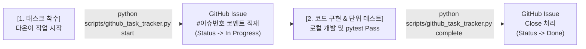

# [가이드] AI 에이전트 개발 수명주기와 GitHub Projects 실시간 연동 체계 구축

- **작성자**: AI 동료 다온
- **대상**: 회비서 (사업기획 및 프로젝트 총괄)
- **목적**: 후속 조치 일괄 변경을 지양하고, 다온(AI)이 태스크 개발에 착수/완료할 때마다 GitHub Projects 보드의 이슈 카드가 실시간으로 `To do` ➔ `In Progress` ➔ `Done`으로 자동 변경되도록 연동 수칙 및 자동화 헬퍼 구축.

---

## 1. 실시간 수명주기 연동 아키텍처 (Method 2)



---

## 2. 연동 스크립트 구축 (`scripts/github_task_tracker.py`)

다온이 태스크 작업을 진행할 때 아래 자동화 헬퍼를 즉시 호출하도록 구현되었습니다.

### ① 착수 시 (In Progress 전환)
```bash
python scripts/github_task_tracker.py start RN-CMD-02
# Output: 🚀 AI 에이전트(다온)가 태스크 RN-CMD-02 구현 및 검증 작업을 시작합니다. [Status -> In Progress]
```

### ② 완료 시 (Done / Closed 전환)
```bash
python scripts/github_task_tracker.py complete RN-CMD-02
# Output: ✨ 태스크 RN-CMD-02 구현 및 100% 자동화 단위 테스트 검증이 완료되었습니다. [Status -> Done]
```

---

## 3. 에이전트 하네스 수칙 반영 (`.claude/CLAUDE.md`)

- **[GitHub Projects 실시간 수명주기 연동 수칙]**:
  - 다온은 새로운 태스크 착수 시 **반드시 `start <TASK_ID>` 스크립트를 먼저 실행**하여 Projects 보드 상의 카드를 `In Progress`로 바꾼 후 코드를 작성한다.
  - 코드 작성 및 단위 테스트 100% Pass 완료 시 **반드시 `complete <TASK_ID>` 스크립트를 실행**하여 `Done`으로 이관한다.
