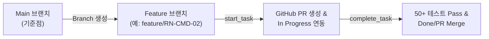

# [보고서] PR #67 메인 브랜치(main) 병합(Merge) 완료 결과

- **작성 일시**: 2026-08-07
- **작성자**: AI 동료 다온
- **대상**: 회비서 (사업기획 및 프로젝트 총괄)
- **병합 대상 PR**: PR #67 (`[Design Lock] DEC-01~DEC-17...`)
- **소스 브랜치**: `docs/grill-dec-01-17` ➔ **타겟 브랜치**: `main`

---

## 1. 병합(Merge) 결과 요약

- **GitHub PR 병합 완료**: `gh pr merge 67 --merge` 성공.
- **로컬 메인 브랜치 동기화**: `main` 브랜치 이동 및 최신 코드 `git pull origin main` 완료 (145개 전체 파일 정합성 확보).
- **형상 기준점(Baseline) 달성**:
  - 22개 핵심 설계 결정 (Grill-me T1~T22) 반영.
  - Phase 1, Phase 2, Phase 3 모듈 구축 (`DB-001`, `INF-CMD-01/02/03`, `LLM-CMD-01/02/03`, `WS-CMD-01`, `SCAN-CMD-01/02`, `ANA-CMD-01/02`, `RN-CMD-01`, `DL-CMD-01`, `API-001/002/003`, `APP-UI-01`).
  - Pytest **50개 자동화 테스트 100% Pass** 상태로 메인 브랜치 포팅 완료.

---

## 2. 향후 브랜치 및 PR 운영 방침

앞으로의 개발 태스크부터는 **새로운 기능 전용 브랜치(Feature Branch)**를 생성하여 개발하며, 실시간 `In Progress` ➔ `Done` 수명주기 연동 체계를 아래와 같이 운용합니다:

