# Software Requirements Specification (SRS) — v1.1 (after grill)
Document ID: SRS-001  
Revision: 1.1 (after grill)  
Date: 2026-08-06  
Standard: ISO/IEC/IEEE 29148:2018

### Revision History

| Rev | Date | 내용 |
|:---|:---|:---|
| **1.1** | 2026-08-06 | **구현 착수 전 `grill-it` 세션 결과 반영 — 미해소 결정 토픽 17건(T1–T17) 전부 RESOLVED.** 확정 사항 **`DEC-01` ~ `DEC-17`** 신설 및 이에 따른 본문·다이어그램·요구사항·추적표 정합화. 상세 결정 근거와 반영 내역은 `docs/grill/GRILL_LEDGER.md` 참조.<br/>· **§3.2 `DEC-01`** 데스크톱 셸 확정(pywebview+WebView2, PyInstaller `--onefile`, React 정적 SPA·HashRouter / Electron·Tauri·Next.js·Node 런타임 배제)<br/>· **§3.3 `DEC-02`** 로컬 API 서버 확정(FastAPI+uvicorn 데몬 스레드, `127.0.0.1`·`port=0`, Bearer 세션 토큰 필수, CORS 와일드카드 금지, OpenAPI 3.1 = 계약 SSOT)<br/>· **§6.1 `DEC-03`** IPC 계약 확정(전 계층 `snake_case`, 단수형 경로, 공통 봉투 `{ok,data}`/`{ok,error}`, 표준 에러 코드 10종, 부분 실패 = HTTP 207)<br/>· **§6.1 `DEC-04`** 장기 작업 모델 확정(202+`task_id`+1초 폴링, WebSocket/SSE 금지, **`Async_Task` 테이블 신설**, 부팅 시 좌초 작업 `interrupted` 전이·자동 재개 금지)<br/>· **§6.2 `DEC-05`** 데이터 접근 계층 확정(stdlib `sqlite3`만, 테이블별 Repository에 SQL 격리, `PRAGMA user_version` 마이그레이션, 스레드-로컬 커넥션, WAL·`foreign_keys=ON`·`busy_timeout`·`synchronous=NORMAL` / SQLAlchemy·Alembic·Prisma 배제)<br/>· **§6.2 `DEC-06`** 벡터 저장소 확정(ChromaDB `PersistentClient`, 워크스페이스당 컬렉션·cosine, Ollama `nomic-embed-text` 768d 명시 주입 / FAISS·torch·sentence-transformers 배제)<br/>· **§6.2.5 `DEC-07`** `Analytics_Log` 결손 보정(`file_id`/`wiki_id` nullable FK·인덱스 추가, 압축률은 스냅샷 COUNT 산출)<br/>· **§6.2.3 `DEC-08`** 딥링크 앵커·경로 정체성 확정(`[[file_id:UUID]]` late binding, `current_path`/`original_path` 분리, Rename·Undo·Watcher 이동은 단일 행 UPDATE)<br/>· **§6.2 `DEC-09`** 크로스 스토어 정합성 확정(Chroma 단일 SSOT, `vector_ids` 폐기, chunk ID `<file_id>:<chunk_index>` 결정론적 계산, 쓰기·삭제 순서 고정, 고아 벡터 lazy delete)<br/>· **§6.2.7 `DEC-10`** 전역 설정 테이블 `App_Config` 단일화(`Settings_Meta` 폐기)<br/>· **§6.2 `DEC-11`** 저장 타입·타임존 규약 확정(UUID=TEXT, DATETIME=TEXT ISO-8601 UTC, `strftime` 기본값, `ON UPDATE CURRENT_TIMESTAMP` 폐기)<br/>· **§6.3 `DEC-12`** 클라우드 프로바이더·비밀 관리 확정(Anthropic `claude-sonnet-5` 단일, API 키 **Windows DPAPI** 암호화, 단가·모델 ID는 `App_Config`)<br/>· **§6.3.2 `DEC-13`** 로컬 LLM·프로비저닝 확정("오프라인"은 정상 상태의 속성, 모델 2종 역할 분리, `assisted`/`detect_only` 2모드, 실패는 `LLM_PROVISION_REQUIRED` 즉시 종료·폴백 금지) + **REQ-NF-005 정밀화**<br/>· **§6.3.3 `DEC-14`** PII 마스킹 확정(정규식 전용 7종, NER 범위 외, 토큰 `[PII:TYPE]` 단일, 무결성 **2조건 AND**, fail-closed, 로그 위생)<br/>· **§4.2 `DEC-15` + REQ-NF-018 신설** 네트워크 egress 3층 방어(단일 `NetworkGuard` 관문 + `purpose` 태그 + 코드 상수 화이트리스트 exact match / CI import 린트 / 패킷 캡처, 원격 텔레메트리 SDK 전면 금지)<br/>· **§6.3 `DEC-16`** LLM 실패·비용 정책 확정(엔진 자동 전환 금지, 일시적 오류만 3회 지수 백오프, 파일 단위 실패 격리 → 207+`data.failed[]`, 연속 10건 실패 시 중단, 단가는 마이그레이션 시드+기준일 병기 추정치) + TC-AVAIL-003<br/>· **§6.3.3 `DEC-17`** Rename 프롬프트 경로 확정(동일 `PIIFilter` 게이트 재사용·전용 로직/분기 금지, **절대 경로 미전송** — 파일명·확장자·1-depth 폴더명·뎁스만, 토큰 잔존 시 수동 확인·역치환 금지, Windows 파일명 안전성 검증) + TC-SEC-005 |
| 1.0 | 2026-07-16 | 초기 SRS 작성 (ISO/IEC/IEEE 29148:2018 구조) |

-------------------------------------------------

## 1. Introduction

### 1.1 Purpose

본 Software Requirements Specification(SRS)은 10인 미만 중소기업이 겪고 있는 **로컬 문서 파편화**(C1: 1일 60~120분 낭비) 및 **기밀 유출 불안**(A1: SaaS 솔루션 검열 미통과) 문제를 해결하기 위한 **CorpBrain MVP** 데스크톱 애플리케이션의 기술적 요구사항을 완전하게 정의한다.

본 문서는 PRD v1.1(REF-01)에서 정의된 비즈니스 목표—**문서 파악 소요 시간 60분 → 10분 이내(83.3% 단축)** 및 **보안 사고율 0%**—를 달성하기 위한 구체적 시스템 동작, 인터페이스, 데이터 모델, 그리고 제약 사항을 명시하며, 향후 설계·구현·테스트·인수(Acceptance)의 **원천 기준(Source of Truth)**으로 사용된다.

### 1.2 Scope

**In-Scope (범위 내):**

| # | 항목 | 설명 |
|---|------|------|
| S-01 | Windows 독립형 데스크톱 앱 | PyInstaller 패키징 단일 `.exe` 제공 |
| S-02 | 로컬 파일 파싱 | `.docx`, `.pdf`, `.txt`, `.md` 포맷 지원 |
| S-03 | 로컬 DB 영구 저장 | SQLite(메타데이터) + ChromaDB(벡터) — `DEC-06` |
| S-04 | 하이브리드 LLM 엔진 | Option A(Anthropic `claude-sonnet-5`, PII 마스킹) / Option B(로컬 Ollama `qwen2.5:7b-instruct`) — `DEC-12`·`DEC-13` |
| S-05 | 실시간 Watcher | OS 파일 변경 감지 및 백그라운드 위키 자동 갱신 |
| S-06 | Trust-Anchor 딥링크 | 위키 문장 → 로컬 원문 파일 직결 |
| S-07 | 워크스페이스 & 대시보드 | 다중 폴더 병합, 파일 통계, 예상 소요 시간 표시 |
| S-08 | 일괄 Rename & Undo | AI 추천 네이밍 일괄 적용 및 100% 원복 |
| S-09 | 앱 내장 생산성 통계 | My Analytics 대시보드 (절약 시간, 팩트체크율 등) |

**Out-of-Scope (범위 외):**

| # | 항목 | 근거 |
|---|------|------|
| X-01 | 전사 통합 검색 엔진(Enterprise Search) | PRD §3.3 Anti-Goals |
| X-02 | 중앙집중형 클라우드 문서 저장소 | PRD §3.3 Anti-Goals |
| X-03 | `.hwp`, `.xlsx`, `.pptx` 복합 문서 지원 | MVP 기준 제외 |
| X-04 | macOS / Linux 환경 | MVP는 Windows OS 한정 |
| X-05 | GA 등 외부 원격 통계 전송 | PRD §7 폐쇄망 원칙 |

### 1.3 Definitions, Acronyms, Abbreviations

| 용어 | 정의 |
|------|------|
| **AOS (Adjusted Opportunity Score)** | 시장 내 기회의 크기와 실현 가능성을 조정하여 산출한 기회 점수 |
| **ChromaDB** | 로컬 환경에서 작동하는 오픈소스 벡터 임베딩 데이터베이스 |
| **Deep-link (딥링크)** | 위키 문장과 원문 파일 간의 직결 하이퍼링크(`os.startfile` 기반) |
| **DOS (Discovered Opportunity Score)** | 사용자 리서치를 통해 발굴된 기회의 우선순위 점수 |
| **FAISS** | Facebook AI Similarity Search. 벡터 유사도 검색 라이브러리 |
| **JTBD (Jobs to be Done)** | 고객이 제품을 사용하는 근본적 동기(완수할 과업) |
| **NER (Named Entity Recognition)** | 텍스트에서 고유명사(인명, 지명 등)를 자동 식별하는 AI 기술 |
| **Ollama** | 로컬 환경에서 LLM을 구동하기 위한 오픈소스 런타임 |
| **PII (Personally Identifiable Information)** | 개인식별정보. 클라우드 전송 전 마스킹 필수 |
| **Trust-Anchor (신뢰 닻)** | AI 요약본(Wiki)과 로컬 원문(Source)을 딥링크로 연결하여 환각(Hallucination)을 검증하는 팩트체크 메커니즘 |
| **Validator** | PRD 내 사용자 스토리의 검증 담당 역할(페르소나) |
| **Watcher** | OS 파일 시스템 이벤트를 감지하여 DB 변경을 트리거하는 백그라운드 데몬(Python `watchdog` 기반) |
| **WPM (Words Per Minute)** | 분당 처리 단어 수. 인간 평균 독해 속도 산출 기준 |
| **Zero-Friction (제로-마찰)** | 수동 업로드 없이 백그라운드 Watcher를 통해 지식 위키가 자동 최신화되는 UX 원칙 |

### 1.4 References

| ID | 문서명 | 비고 |
|----|--------|------|
| **REF-01** | `10_CorpBrain_PRD_v1.1_after_grill.md` | Product Requirements Document v1.1 (after grill) |
| **REF-02** | `01_CorpBrain_VPS.md` | Value Proposition Statement (제품 비전 선언문) |
| **REF-03** | ISO/IEC/IEEE 29148:2018 | Systems and software engineering — Life cycle processes — Requirements engineering |
| **REF-04** | `docs/grill/GRILL_LEDGER.md` | Grill Ledger — 결정 토픽 원장(T1–T17) 및 `DEC-01`~`DEC-17` 결정 근거·반영 내역 |

### 1.5 Constraints and Assumptions

#### 1.5.1 Constraints (제약사항)

| ID | 유형 | 내용 |
|----|------|------|
| CON-01 | Platform | MVP는 **Windows OS**(10/11) 환경으로 제한한다. |
| CON-02 | Architecture | SaaS가 아닌 **완전 로컬 구동형** 단일 `.exe` 형태로 배포한다 (PyInstaller 패키징). |
| CON-03 | Security | 애플리케이션 코드에 외부 클라우드로 파일 내용을 은밀히 전송하는 Telemetry 로직을 **원천 배제**해야 한다. 정상 상태(steady state) 기준이며, 사용자가 개시하는 준비 단계의 바이너리 다운로드는 별개 행위로 구분한다 (`DEC-13`). |
| CON-04 | File System | Windows MAX_PATH(260자) 제한 및 시스템 폴더 접근 권한 제약을 방어적으로 처리해야 한다. |
| CON-05 | Resource | 로컬 LLM(Ollama) 구동 시 사용자 PC의 CPU/GPU 자원을 점유하므로 유휴 시 리소스 영향을 최소화해야 한다. |
| CON-06 | Data Format | MVP에서 지원하는 파일 포맷은 `.docx`, `.pdf`, `.txt`, `.md`로 한정한다. |

#### 1.5.2 Assumptions (가정)

| ID | 내용 |
|----|------|
| ASM-01 | 주 타겟 사용자(10인 미만 중소기업)의 업무용 기기는 Windows OS이다. |
| ASM-02 | 로컬 LLM 구동 시 일정 수준의 CPU/GPU 자원 점유가 발생함을 사용자가 인지하고 동의한다. |
| ASM-03 | 사용자는 분석 대상 문서가 저장된 로컬 폴더에 대한 읽기/쓰기 권한을 보유하고 있다. |
| ASM-04 | Option A(클라우드 API) 사용 시 사용자는 유효한 API 키를 직접 입력하며, 해당 비용은 사용자 부담이다. |
| ASM-05 | 인간의 평균 독해 속도(WPM)는 약 200~250 WPM을 기준으로 절약 시간을 산출한다. |
| ASM-06 | 폐쇄망 환경에서는 **관리자가 Ollama와 필요 모델을 사전 프로비저닝**하며, 앱은 이를 탐지만 한다. 앱이 설치를 시도하지 않는다 (`DEC-13`). |

#### 1.5.3 Risks (리스크)

| ID | 리스크 | 완화 전략 |
|----|--------|-----------|
| RSK-01 | 로컬 LLM 추론 품질이 클라우드 대비 낮을 수 있음 | 하이브리드 엔진으로 사용자가 Option A/B를 자유롭게 전환 가능하도록 설계 |
| RSK-02 | 대용량 문서(수천 개) 처리 시 PC 리소스 과부하 | 10,000개 파일 상한 및 일시 정지 방어 로직 적용 |
| RSK-03 | PII 마스킹 정규식의 미탐(False Negative) — 특히 **인명·기관명은 정규식으로 탐지되지 않음** | 마스킹 실패 시 전송 차단 Fail-Safe 설계(`DEC-14` 2조건 판정), **Option A 최초 전송 전 마스킹 결과 미리보기·명시적 동의**, 설정 화면에 미탐 범위 고정 안내. NER 도입은 `DEC-06`·CON-02 재검토가 필요한 별개 결정으로 분리 |

---

## 2. Stakeholders

| Role (역할) | Responsibility (책임) | Interest (주요 관심사) |
|:---|:---|:---|
| **C1 (실무자 — 기획자/개발자)** | 파편화된 프로젝트 산출물을 스캔하여 프로젝트 맥락을 파악하고, 생성된 위키를 업무에 활용한다. | 수많은 문서를 일일이 열어보지 않고 핵심 내용을 **10분 이내**에 파악하여 1일 60~120분의 낭비 시간을 제거한다. |
| **A1 (보안/검토자)** | 신규 소프트웨어 도입 시 사내 기밀 유출 여부 및 망분리 규정 준수를 검토한다. | 로컬 LLM을 통한 **폐쇄형 보안 환경** 유지 및 외부 서버로의 데이터 전송 **원천 차단** 확인. |
| **E1 (PM/관리자)** | 여러 요구사항 문서 및 산출물을 하나의 프로젝트 위키로 취합하고 최신성을 유지한다. | 워크스페이스 내 문서 변경 시 위키가 **자동 갱신**되어 정보 유실 방지 및 **딥링크 팩트체크** 정상 동작. |
| **개발팀** | 본 SRS에 기반하여 시스템을 설계·구현·테스트한다. | 모호하지 않은 기능/비기능 요구사항, 테스트 가능한 AC, 명확한 데이터 모델 및 API 명세. |
| **QA 팀** | Traceability Matrix 및 AC를 기반으로 테스트 케이스를 설계·실행한다. | 각 요구사항 ID에 대응하는 TC ID, 측정 가능한 성능 기준, 재현 가능한 시나리오. |

---

## 3. System Context and Interfaces

### 3.1 External Systems

| 시스템 | 유형 | 설명 |
|--------|------|------|
| **OS File System (Windows)** | 로컬 | 문서 원본이 저장된 로컬 스토리지. 파일 이벤트 감지(`watchdog`) 및 딥링크(`os.startfile`) 실행의 기반 플랫폼. |
| **Ollama Service** | 로컬 데몬 | Option B 선택 시 개인 PC의 로컬 CPU/GPU 자원을 활용하여 오프라인 추론(Inference)을 수행하는 외부 바이너리 프로세스. |
| **Cloud LLM API (Anthropic)** | 원격 | Option A 선택 시 PII 마스킹 완료된 텍스트를 전송받아 추론·요약 결과를 반환하는 외부 REST 엔드포인트. 프로바이더는 **Anthropic 단일 확정**(`DEC-12`). |

### 3.2 Client Applications

| 구성요소 | 기술 스택 | 설명 |
|----------|-----------|------|
| **CorpBrain Desktop App** | React(UI) + Python(Core) + **pywebview 셸** | PyInstaller로 패키징된 독립형 실행 파일(`.exe`). Python이 주 프로세스(host)이며, **pywebview**가 OS 내장 **WebView2(Edge Chromium)** 를 임베드하여 정적 빌드된 React 번들을 렌더링한다. UI와 Core는 동일 프로세스 내 로컬 REST IPC로 결합. |

**DEC-01 — 데스크톱 셸 및 패키징 구조 (확정)**

| 항목 | 결정 |
|:---|:---|
| 셸(Shell) | **pywebview** (Windows 백엔드 = WebView2 / EdgeChromium) |
| 프로세스 모델 | **단일 프로세스** — Python이 host, WebView는 임베드된 렌더러. Electron/Tauri 사이드카 구조를 **채택하지 않는다.** |
| 패키징 | **PyInstaller** `--onefile` → `CorpBrain.exe` 1개 (React 정적 번들을 `--add-data`로 내장) |
| 프론트엔드 빌드 | React SPA를 **정적 번들로 프리빌드**하여 exe에 내장 (Vite 빌드, **Tailwind CSS + Shadcn UI**, **Zustand** 전역 상태 관리 적용). Next.js SSR·Node 런타임 의존 **금지** (해시 라우터 기반 클라이언트 라우팅만 사용) |
| 런타임 전제 | WebView2 Runtime (Windows 11 및 최신 Windows 10 기본 탑재). 부재 시 **Evergreen Bootstrapper 안내 다이얼로그**를 표시하고 앱을 크래시 없이 종료 |
| 근거 | CON-02(단일 `.exe` 로컬 구동형) 및 REQ-NF-004(`%LocalAppData%` 격리)를 문자 그대로 충족하며, Node·Rust 런타임을 도입하지 않아 Python 중심 스택을 유지 |

### 3.3 API Overview

내부 UI 컴포넌트(React)와 백엔드 코어(Python) 간 통신을 위한 주요 로컬 API는 다음과 같다. 상세 명세는 **Appendix 6.1** 참조.

**DEC-02 — API 프레임워크 및 로컬 서버 바인딩 (확정)**

| 항목 | 결정 |
|:---|:---|
| 프레임워크 | **FastAPI** + **uvicorn** (`asyncio`). DTO는 **Pydantic v2** 모델로 정의하여 검증·직렬화·OpenAPI 생성을 단일 소스로 처리 |
| 구동 방식 | pywebview 창 생성 **이전에** uvicorn을 **데몬 스레드**로 부팅하고 `/api/v1/health` 응답을 확인한 뒤 WebView를 로드 |
| 바인딩 주소 | **`127.0.0.1` 전용** (루프백). `0.0.0.0` 바인딩은 **금지** — 외부 인터페이스 노출 원천 차단 |
| 포트 | **OS 할당 랜덤 포트**(`port=0`). 고정 포트를 쓰지 않는다. 실제 포트는 런타임에 소켓에서 조회하여 프론트엔드로 주입 |
| 인증 | 프로세스 부팅 시 `secrets.token_urlsafe(32)`로 **세션 토큰**을 생성. 모든 `/api/v1/*` 요청은 `Authorization: Bearer <token>` 필수. 미들웨어에서 불일치 시 **401** 반환 |
| 토큰·URL 전달 | pywebview `window.evaluate_js()`(또는 초기 HTML 주입)로 `window.__CORPBRAIN__ = { baseUrl, token }` 주입. **디스크·환경변수·로그에 토큰을 기록하지 않는다** |
| CORS | `allow_origins`를 주입된 로컬 origin으로만 제한. 와일드카드 `*` **금지** |
| 계약 산출물 | FastAPI가 생성하는 **OpenAPI 3.1 스키마를 SSOT**로 삼고, 프론트엔드 TypeScript 타입은 이 스키마에서 **생성**한다 (수동 이중 관리 금지) |
| 근거 | SRS §6.1의 REST 계약과 `API-001~003`의 DTO Validation·OpenAPI 요구를 재작성 없이 충족하며, 루프백 한정 + 랜덤 포트 + Bearer 토큰으로 동일 PC 내 타 프로세스(브라우저 탭·악성 스크립트)의 API 접근을 차단 |

> **보안 주의:** 로컬 REST 서버는 동일 PC의 모든 프로세스가 접근을 시도할 수 있는 표면이다. 랜덤 포트는 은닉 수단일 뿐이며 **실질적 방어선은 Bearer 토큰 검증 미들웨어**다. 토큰 검증을 우회하는 엔드포인트(개발용 디버그 라우트 포함)를 추가해서는 안 된다.

| Method | Endpoint | 설명 | 관련 기능 |
|--------|----------|------|-----------|
| `POST` | `/api/v1/workspace` | 워크스페이스 생성 (다중 폴더 병합) | F1 |
| `GET` | `/api/v1/workspace/{id}` | 워크스페이스 상세 조회 | F1 |
| `DELETE` | `/api/v1/workspace/{id}` | 워크스페이스 삭제 | F1 |
| `GET` | `/api/v1/workspace/{id}/scan` | 파일 트리 스캔 및 대시보드 통계 반환 | F1 |
| `POST` | `/api/v1/analyze/fast` | 파일명/경로 기반 고속 분석 | F3 |
| `POST` | `/api/v1/analyze/deep` | 전체 텍스트 파싱 및 위키 생성 | F3 |
| `POST` | `/api/v1/llm/inference` | 하이브리드 LLM 라우터 추론 요청 | F2 |
| `POST` | `/api/v1/llm/onboard` | Ollama 원클릭 설치 및 모델 다운로드 | F2 |
| `POST` | `/api/v1/rename/apply` | AI 추천 Batch Rename 적용 | F4 |
| `POST` | `/api/v1/rename/undo` | Rename 실행 취소 (원복) | F4 |
| `GET` | `/api/v1/workspace` | 전체 워크스페이스 목록 조회 | F1 |
| `GET` | `/api/v1/analyze/{task_id}/progress` | 분석 진행 상태 조회 | F3 |
| `GET` | `/api/v1/llm/health` | LLM 엔진 연결 상태 확인 | F2 |
| `GET` | `/api/v1/analytics/summary` | My Analytics 생산성 통계 조회 | F7 |
| `PUT` | `/api/v1/watcher/config` | Watcher 동작 모드 설정 변경 | F6 |
| `GET` | `/api/v1/watcher/status` | Watcher 현재 상태 조회 | F6 |

### 3.4 Interaction Sequences

#### 3.4.1 핵심 시퀀스: 워크스페이스 생성 → 심층 분석 → 위키 생성

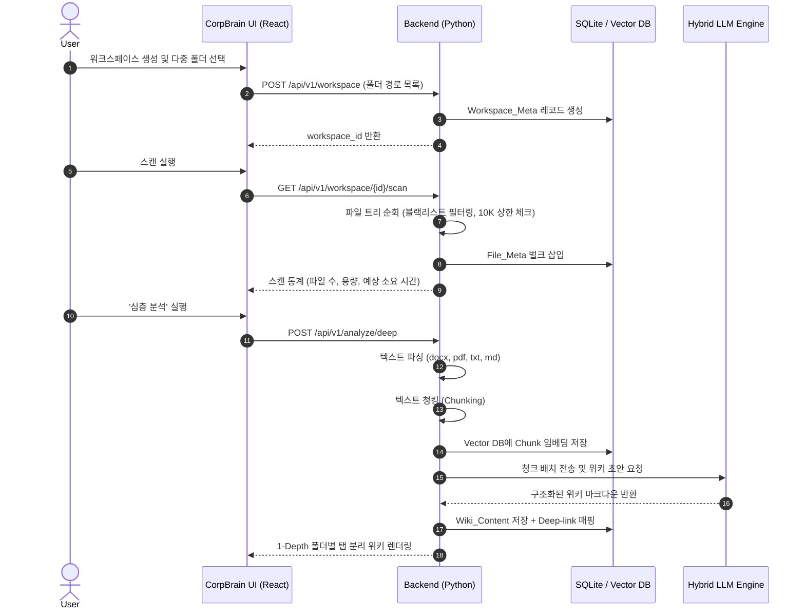

#### 3.4.2 핵심 시퀀스: 백그라운드 Watcher 실시간 위키 갱신

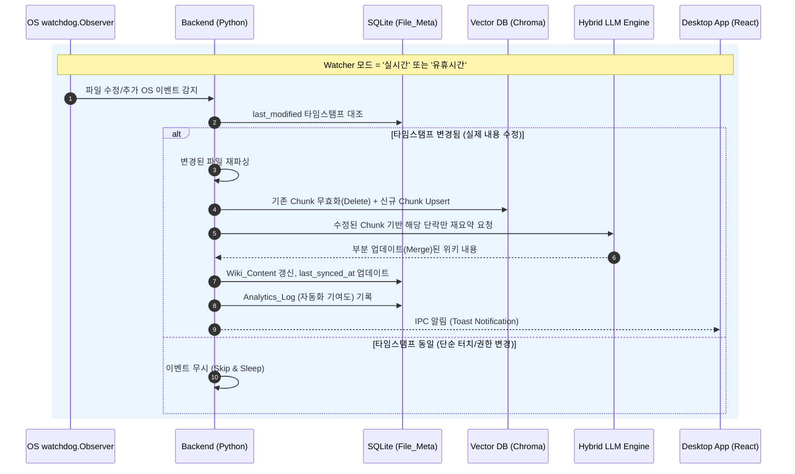

#### 3.4.3 핵심 시퀀스: 고속 분석 및 문서 중요도 랭킹

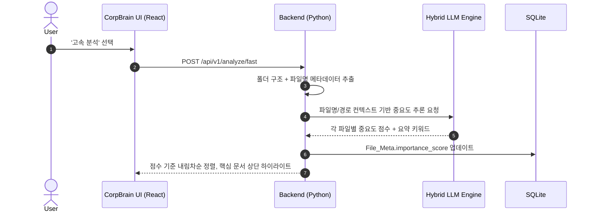

### 3.5 Use Case Diagram

시스템 경계 내 주요 기능(Use Case)과 3개 액터(C1/A1/E1)의 상호작용을 조감한다.

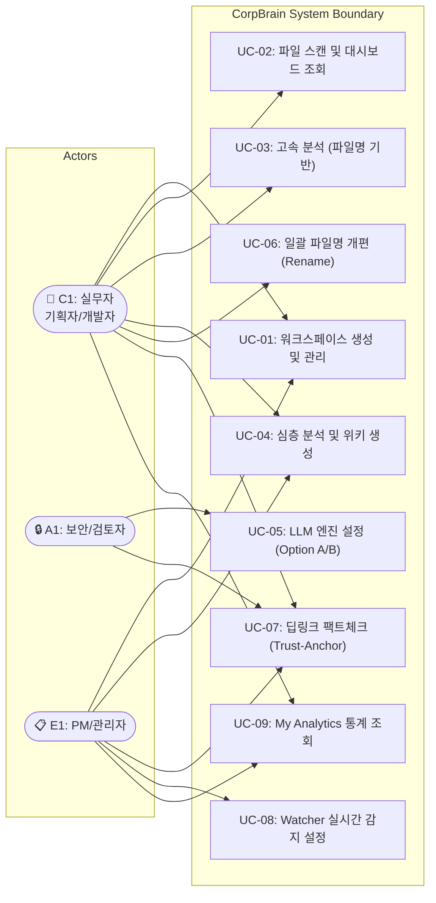

| UC ID | Use Case | 주요 액터 | 관련 기능 | 관련 REQ-FUNC |
|-------|----------|----------|-----------|---------------|
| UC-01 | 워크스페이스 생성 및 관리 | C1, E1 | F1 | 001~002 |
| UC-02 | 파일 스캔 및 대시보드 조회 | C1 | F1 | 003~006 |
| UC-03 | 고속 분석 (파일명 기반) | C1 | F3 | 012 |
| UC-04 | 심층 분석 및 위키 생성 | C1, E1 | F3 | 013~015 |
| UC-05 | LLM 엔진 설정 (Option A/B) | A1 | F2 | 007~011 |
| UC-06 | 일괄 파일명 개편 (Rename) | C1 | F4 | 016~019 |
| UC-07 | 딥링크 팩트체크 (Trust-Anchor) | C1, A1, E1 | F5 | 020~022 |
| UC-08 | Watcher 실시간 감지 설정 | E1 | F6 | 023~026 |
| UC-09 | My Analytics 통계 조회 | C1, E1 | F7 | 027~030 |

### 3.6 Component Diagram

CorpBrain 시스템의 계층 구조와 컴포넌트 간 의존 관계를 명시한다.

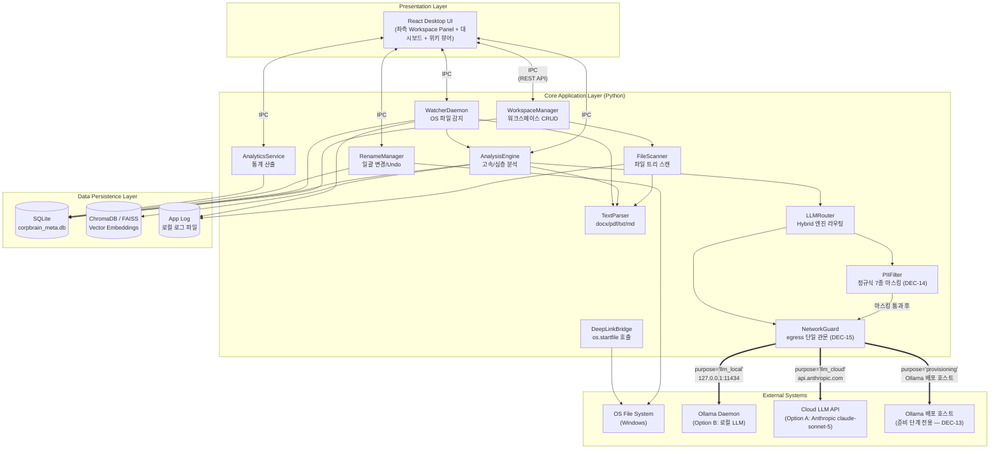

---

## 4. Specific Requirements

### 4.1 Functional Requirements

#### 4.1.1 F1: 워크스페이스 기반 파서 및 대시보드

| ID | Feature | Source (PRD) | Priority | Description | Acceptance Criteria (Given/When/Then) |
|:---|:---|:---|:---|:---|:---|
| **REQ-FUNC-001** | Workspace Creation | REF-01 §5 F1 | Must | 사용자가 2개 이상의 로컬 폴더를 선택하여 하나의 논리적 프로젝트 워크스페이스로 병합·생성할 수 있다. | **Given** 사용자가 2개 이상의 로컬 폴더를 선택했을 때, **When** 워크스페이스 생성을 요청하면, **Then** 시스템은 `Workspace_Meta` 레코드를 생성하고 좌측 히스토리 패널에 해당 워크스페이스를 영구 표시한다. |
| **REQ-FUNC-002** | Workspace Persistence | REF-01 §5 F1 | Must | 생성된 워크스페이스는 애플리케이션 재시작 후에도 히스토리 패널에서 즉시 접근 가능해야 한다. | **Given** 워크스페이스가 1개 이상 생성된 상태에서, **When** 앱을 종료 후 재실행하면, **Then** 이전에 생성된 모든 워크스페이스가 히스토리 패널에 동일한 순서로 표시된다. |
| **REQ-FUNC-003** | Dashboard Scan Stats | REF-01 §5 F1 | Must | 파일 트리 스캔 직후 파일 개수, 총 용량, 분석 예상 소요 시간을 오버뷰 대시보드에 시각화한다. | **Given** 워크스페이스 선택 직후, **When** 파일 트리 스캔이 완료되면, **Then** 스캔된 파일의 총 개수, 총 용량(MB), 분석 예상 소요 시간(초)을 대시보드에 즉시 표기한다. |
| **REQ-FUNC-004** | Scan File Limit Guard | REF-01 §5 F1 | Must | 파일 트리 스캔 시 10,000개 파일 도달 시 일시 정지하고 사용자에게 확인을 요청한다. | **Given** 로컬 파일 트리를 순회하는 도중, **When** 유효 파일 수가 10,000개에 도달하면, **Then** 스캔을 일시 정지하고 사용자에게 계속 진행 여부를 확인하는 다이얼로그를 표시한다. |
| **REQ-FUNC-005** | Blacklist Folder Filter | REF-01 §5 F1 | Must | `.git`, `Windows`, `node_modules` 등 블랙리스트 폴더 및 미지원 포맷 파일을 스캔에서 자동 제외한다. | **Given** 파일 트리 순회 중, **When** 사전 정의된 블랙리스트 폴더명 또는 미지원 확장자(`S-02` 외)를 만나면, **Then** 해당 경로를 Skip하고 로그에 기록한 뒤 다음 항목으로 진행한다. |
| **REQ-FUNC-006** | Supported Format Parsing | REF-01 §5 F1 | Must | `.docx`, `.pdf`, `.txt`, `.md` 4개 포맷의 텍스트를 정상적으로 추출한다. | **Given** 워크스페이스 내에 4개 지원 포맷 파일이 각 1개 이상 존재할 때, **When** 텍스트 파싱을 실행하면, **Then** 각 포맷에서 본문 텍스트가 정상 추출되어 빈 문자열이 아닌 결과를 반환한다. |

#### 4.1.2 F2: 하이브리드 LLM 구동 엔진

| ID | Feature | Source (PRD) | Priority | Description | Acceptance Criteria (Given/When/Then) |
|:---|:---|:---|:---|:---|:---|
| **REQ-FUNC-007** | Hybrid LLM Router | REF-01 §5 F2 | Must | 환경 설정(Option A/B)에 따라 Cloud API 또는 로컬 Ollama로 추론 요청을 라우팅한다. | **Given** 사용자가 설정에서 Option A 또는 B를 선택했을 때, **When** 텍스트 분석 요청이 발생하면, **Then** 선택된 엔진으로 추론 요청을 전달하고 결과를 동일한 인터페이스로 반환한다. |
| **REQ-FUNC-008** | PII Masking (Option A) | REF-01 §5 F2, §6.1 | Must | Option A(클라우드) 선택 시 네트워크 I/O 발생 전 메모리 상에서 PII를 **정규식 기반**으로 마스킹 처리한다 (NER은 MVP 범위 외 — `DEC-14`). | **Given** Option A 모드에서 텍스트 전송 직전, **When** PII 필터링 모듈이 실행되면, **Then** 소켓 연결 이전에 메모리 상에서 주민등록번호·전화번호·이메일·계좌·카드·사업자번호·여권번호가 **`[PII:TYPE]` 타입 태그 토큰**으로 치환되고, 원문은 로컬에만 보존된다. |
| **REQ-FUNC-009** | PII Masking Fail-Safe | REF-01 §6.1 | Must | PII 마스킹 처리 중 오류 발생 또는 **무결성 2조건 미충족** 시 해당 텍스트의 외부 전송을 차단한다 (`DEC-14`). | **Given** PII 필터링 처리 중 예외가 발생했거나 검증 조건이 미충족일 때, **When** 무결성을 검증하면(ⓐ결과 재스캔 매치 0건 **AND** ⓑ원본 매치 문자열 substring 부재), **Then** 해당 텍스트 청크의 외부 전송을 차단하고 `PII_MASKING_FAILED`를 기록하며 사용자에게 알림을 표시한다. **로그에 원본 PII 문자열을 남기지 않는다.** |
| **REQ-FUNC-010** | Local LLM Provisioning | REF-01 §5 F2 | Must | **네트워크 가용 환경**에서는 Ollama 미설치 시 원클릭 백그라운드 설치·모델 Pull을 지원하고(`assisted` 모드), **폐쇄망 환경**에서는 사전 설치된 Ollama를 탐지만 하여 준비 완료로 판정한다(`detect_only` 모드). 두 모드 모두 임베딩 모델과 생성 모델을 구분해 처리한다 (`DEC-13`). | **Given** Option B 모드이나 PC에 Ollama가 미설치 상태일 때, **When** 사용자가 분석을 시도하면, **Then** 네트워크 도달 가능 시 터미널 노출 없이 백그라운드 설치 및 모델 Pull을 수행하고 진행률(%)을 표시하며, 폐쇄망(다운로드 실패)에서는 **설치를 재시도하지 않고** 수동 프로비저닝 안내와 필요 모델 목록(`nomic-embed-text`, `qwen2.5:7b-instruct`)을 표시한다. |
| **REQ-FUNC-011** | LLM Health Check | REF-01 §5 F2 | Should | 선택된 LLM 엔진(Option A/B)의 연결 상태를 확인하여 사용 가능 여부를 표시한다. | **Given** 설정 화면 또는 분석 시작 직전, **When** LLM Health Check를 수행하면, **Then** Option A는 API 키 유효성 및 네트워크 도달성을, Option B는 Ollama 데몬 응답 **및 필요 모델 보유 여부**(`GET /api/tags`)를 검증하여 상태 아이콘(✅/❌)을 표시한다 (`DEC-13`). |

#### 4.1.3 F3: 다단계 시맨틱 분석 파이프라인

| ID | Feature | Source (PRD) | Priority | Description | Acceptance Criteria (Given/When/Then) |
|:---|:---|:---|:---|:---|:---|
| **REQ-FUNC-012** | Fast Analysis | REF-01 §5 F3 | Must | 폴더 구조 맥락과 파일명만을 파싱하여 핵심 문서를 유추하고 중요도를 점수화하여 하이라이트한다. | **Given** 사용자가 '고속 분석'을 선택했을 때, **When** 파일명과 경로 메타데이터 추출이 완료되면, **Then** 각 파일의 중요도를 0~100 점수로 산정하여 상위 문서를 UI 상단에 하이라이트 표시한다. |
| **REQ-FUNC-013** | Deep Analysis Wiki | REF-01 §5 F3 | Must | 문서 전체 텍스트를 파싱·청킹하여 벡터 DB에 저장하고, 1-Depth 폴더별로 분리된 구조적 위키를 마크다운으로 생성한다. | **Given** 사용자가 '심층 분석'을 선택했을 때, **When** 전체 파일 파싱 및 청킹이 완료되면, **Then** 벡터 DB에 임베딩을 저장하고 1-Depth 폴더 단위로 탭을 분리한 마크다운 위키를 생성하여 UI에 렌더링한다. |
| **REQ-FUNC-014** | Folder-Tab Separation | REF-01 §5 F3 | Must | 심층 분석 위키는 1-Depth 폴더별 탭으로 분리하여 맥락 혼선(Hallucination)을 방지한다. | **Given** 위키 생성이 완료된 상태에서, **When** 위키를 렌더링하면, **Then** 워크스페이스 하위 1-Depth 폴더 각각이 독립 탭으로 분리되어 표시되고, 탭 간 내용이 혼합되지 않는다. |
| **REQ-FUNC-015** | Analysis Progress Indicator | REF-01 §5 F3 | Should | 비동기 장기 작업(분석 등) 진행 상태 및 에러를 비차단형(Non-blocking) Toast 알림으로 하단 구석에 표시한다. | **Given** 분석이 시작된 상태에서, **When** 파일 처리가 진행되거나 에러가 발생하면, **Then** 하단 구석의 비동기 Toast 알림을 통해 `처리 완료 N / 전체 M` 프로그레스 및 잔여 예상 시간을 실시간 업데이트하고, 작업 완료 시 Toast를 클릭하여 결과로 이동할 수 있어야 한다 (작업 중 UI 차단 금지). |

#### 4.1.4 F4: 일괄 폴더/파일명 개편

| ID | Feature | Source (PRD) | Priority | Description | Acceptance Criteria (Given/When/Then) |
|:---|:---|:---|:---|:---|:---|
| **REQ-FUNC-016** | Naming Template Recommendation | REF-01 §5 F4 | Should | 분석된 파일 맥락을 기반으로 AI가 Naming 템플릿(규칙)을 추천한다. Option A 전송 시 프롬프트는 **`PIIFilter` 마스킹을 통과**해야 하며, **파일명·확장자·1-depth 폴더명·뎁스만** 담고 **절대 경로를 포함하지 않는다** (`DEC-17`). | **Given** 워크스페이스 분석이 완료된 상태에서, **When** 사용자가 '일괄 개편'을 요청하면, **Then** AI가 파일 내용과 폴더 구조를 고려한 Naming 템플릿을 1개 이상 추천하며, 전송 페이로드에는 원본 PII와 절대 경로가 존재하지 않는다. |
| **REQ-FUNC-017** | Rename Diff Preview | REF-01 §5 F4 | Should | 변경 전/후 파일명을 Diff 형태로 미리보기 표시하여 사용자 승인을 받는다. | **Given** AI가 Naming 추천을 완료했을 때, **When** Diff 미리보기를 렌더링하면, **Then** 각 파일의 기존 이름(빨강)과 신규 이름(초록)을 나란히 표시하고 개별/전체 승인 버튼을 제공한다. |
| **REQ-FUNC-018** | Batch Rename Execute | REF-01 §5 F4 | Should | 사용자 승인(Apply) 후 OS 명령어로 물리적 파일명을 일괄 변경한다. | **Given** 사용자가 Diff를 승인(Apply)했을 때, **When** 일괄 변경을 실행하면, **Then** OS 레벨에서 물리적 파일명이 변경되고, 변경 이전 경로와 이후 경로가 `Rename_History` DB에 기록된다. |
| **REQ-FUNC-019** | Undo Rename | REF-01 §5 F4 | Should | Batch Rename 실행 후 언제든 원본 상태로 100% 원복하는 Undo 기능을 제공한다. | **Given** 파일명이 일괄 변경된 상태에서, **When** 사용자가 [실행 취소(Undo)]를 클릭하면, **Then** `Rename_History` DB를 참조하여 변경 직전의 경로와 이름으로 100% 원복하고, 실패한 파일이 있으면 목록을 표시한다. |

#### 4.1.5 F5: 로컬 딥링크 기반 Trust-Anchor

| ID | Feature | Source (PRD) | Priority | Description | Acceptance Criteria (Given/When/Then) |
|:---|:---|:---|:---|:---|:---|
| **REQ-FUNC-020** | Deep-link Generation | REF-01 §5 F5 | Must | 생성된 위키의 각 문장(또는 단락)에 해당 로컬 원문 파일로의 딥링크(Trust-Anchor)를 자동 매핑한다. | **Given** 심층 분석 위키가 생성 완료된 상태에서, **When** 위키 내용을 렌더링하면, **Then** 각 요약 문장 옆에 출처 파일 경로를 포함한 딥링크 아이콘이 표시된다. |
| **REQ-FUNC-021** | Deep-link Navigation | REF-01 §5 F5 | Must | 딥링크 클릭 시 `os.startfile` 브릿지를 호출하여 OS 기본 프로그램으로 원본 파일을 연다. | **Given** 위키에서 딥링크를 렌더링한 상태에서, **When** 사용자가 특정 문장의 딥링크 아이콘을 클릭하면, **Then** `os.startfile`을 호출하여 해당 로컬 파일이 OS 기본 연결 프로그램(Word, Adobe Reader 등)으로 열린다. |
| **REQ-FUNC-022** | Broken Link Detection | REF-01 §5 F5 | Should | **외부 요인**으로 원문 파일이 사라져 딥링크가 깨진 경우 시각적으로 표시한다. 앱 내부의 Rename·Watcher 이동 감지는 `current_path` 갱신으로 흡수되므로 broken 상태를 만들지 않는다 (`DEC-08`). | **Given** 위키에 `[[file_id:UUID]]` 앵커가 매핑된 상태에서, **When** 대상 파일이 앱 외부(탐색기 등)에서 삭제되거나 워처 미감시 경로로 이동해 `File_Meta.current_path`의 실물이 존재하지 않으면, **Then** 해당 딥링크를 비활성화(회색 처리)하고 "원본 파일을 찾을 수 없습니다" 툴팁을 표시한다. |

#### 4.1.6 F6: 실시간 감지 및 백그라운드 위키 갱신 (Watcher)

| ID | Feature | Source (PRD) | Priority | Description | Acceptance Criteria (Given/When/Then) |
|:---|:---|:---|:---|:---|:---|
| **REQ-FUNC-023** | Watcher Mode Config | REF-01 §5 F6 | Must | 파일 감지 동작 모드를 [수동 / 실시간 / 유휴시간 / 끄기] 중 선택할 수 있다. | **Given** 설정 화면에서 Watcher 모드를 변경할 때, **When** 사용자가 4개 옵션 중 하나를 선택하면, **Then** 선택된 모드가 `Watcher_Config` DB에 저장되고 즉시 적용된다. |
| **REQ-FUNC-024** | Real-time File Detection | REF-01 §5 F6 | Must | '실시간' 모드에서 워크스페이스 내 `.docx`, `.pdf`, `.txt`, `.md` 파일의 추가/수정을 OS 이벤트로 감지한다. | **Given** Watcher가 '실시간' 모드로 활성화된 상태에서, **When** 워크스페이스 내 지원 포맷 파일이 추가 또는 수정되면, **Then** 1초 이내에 해당 이벤트를 감지하여 처리 큐에 적재한다. |
| **REQ-FUNC-025** | Background Wiki Update | REF-01 §5 F6 | Must | 감지된 변경분을 백그라운드에서 재분석하여 위키를 자동 업데이트(Merge)하고 UI에 알림을 보낸다. | **Given** Watcher가 파일 변경 이벤트를 감지한 상태에서, **When** 변경된 파일의 `last_modified` 타임스탬프가 DB 캐시와 상이하면, **Then** 해당 파일만 재파싱·재요약하여 위키를 부분 갱신하고 Toast 알림을 표시한다. |
| **REQ-FUNC-026** | Idle-mode Watcher | REF-01 §5 F6 | Should | '유휴시간' 모드에서는 사용자 미입력 상태(Idle) 진입 후에만 백그라운드 분석을 시작한다. | **Given** Watcher가 '유휴시간' 모드인 상태에서, **When** 사용자 키보드/마우스 입력이 일정 시간(기본 5분) 이상 없으면, **Then** 누적된 변경 이벤트를 일괄 처리하고 유저 입력 재개 시 처리를 일시 중단한다. |

#### 4.1.7 Telemetry & My Analytics (생산성 통계)

| ID | Feature | Source (PRD) | Priority | Description | Acceptance Criteria (Given/When/Then) |
|:---|:---|:---|:---|:---|:---|
| **REQ-FUNC-027** | Time Saved Metric | REF-01 §7 | Must | AI가 처리한 총 텍스트량(토큰 수)을 인간 평균 독해 속도(WPM)와 비교하여 "절약된 시간"을 산출한다. | **Given** 분석이 1회 이상 완료된 상태에서, **When** My Analytics 화면에 진입하면, **Then** `처리된 총 토큰 수 ÷ (250 WPM × 평균 토큰/단어 비율)`로 산출한 절약 시간을 "이번 주 N시간 절약" 형태로 표시한다. |
| **REQ-FUNC-028** | Fact-Check Rate Metric | REF-01 §7 | Must | 생성된 위키 내 딥링크를 클릭하여 원문을 확인한 누적 횟수를 추적·표시한다. | **Given** 딥링크가 1회 이상 클릭된 상태에서, **When** My Analytics 화면에 진입하면, **Then** "이번 달 N번의 팩트체크로 환각을 방어했습니다" 형태의 수치를 표시한다. |
| **REQ-FUNC-029** | Knowledge Size Metric | REF-01 §7 | Must | 파편화된 파일 N개가 몇 개의 통합 위키로 구조화되었는지 압축률을 시각화한다. | **Given** 1개 이상의 워크스페이스에서 위키가 생성된 상태에서, **When** My Analytics 화면에 진입하면, **Then** `원본 파일 수 : 생성된 위키 수` 비율과 압축률(%)을 차트로 시각화한다. |
| **REQ-FUNC-030** | Automation Score Metric | REF-01 §7 | Must | Watcher 데몬이 자동으로 위키를 업데이트한 누적 횟수를 수치화한다. | **Given** Watcher에 의한 자동 갱신이 1회 이상 발생한 상태에서, **When** My Analytics 화면에 진입하면, **Then** "Watcher가 자동으로 N회 위키를 갱신했습니다" 형태의 자동화 기여도 수치를 표시한다. |

### 4.2 Non-Functional Requirements

| ID | Category | Metric / Standard | Description | Verification Method |
|:---|:---|:---|:---|:---|
| **REQ-NF-001** | Performance | Latency (Scan) | 로컬 파일 트리 1,000개 스캔 및 대시보드 통계 계산이 **p95 < 5,000ms** 이내에 완료되어 UI Freezing을 방지해야 한다. | TC-PERF-001: 1,000개 파일이 포함된 테스트 폴더에서 스캔 10회 반복, p95 응답 시간 측정 |
| **REQ-NF-002** | Performance | Resource Usage (Idle) | 백그라운드 Watcher 데몬 유휴 상태에서 **CPU 점유율 < 1%**, **RAM < 100MB**를 유지해야 한다. | TC-PERF-002: Watcher 활성 상태에서 5분간 리소스 모니터링, 평균/최대 CPU·RAM 측정 |
| **REQ-NF-003** | Performance | Deep Analysis Throughput | 100개 파일(평균 5KB/파일) 심층 분석이 Option A(클라우드) 기준 **300초 이내**에 완료되어야 한다. | TC-PERF-003: 100개 표준 테스트 파일 세트로 심층 분석 3회 반복, 완료 시간 측정 |
| **REQ-NF-004** | Security | Data Isolation | 모든 메타데이터 및 로컬 DB(SQLite, ChromaDB) 파일은 **`%LocalAppData%\CorpBrain`** 경로에만 격리 보관되어야 한다. | TC-SEC-001: 앱 설치 후 DB 파일 생성 경로 검증, 타 경로 미생성 확인 |
| **REQ-NF-005** | Security | Telemetry Blocking | **분석 대상 문서의 내용·파일 경로·시스템 사용 로그**를 외부로 전송하는 로직이 코드 레벨에서 **원천 배제**되어야 한다 (보안 사고율 0%). 사용자가 명시적으로 개시한 두 가지 통신만 예외다: ① Option A 선택 시 마스킹된 청크의 Anthropic API 전송, ② 프로비저닝 단계의 Ollama 인스톨러·모델 바이너리 다운로드 (`DEC-13`). 강제 수단은 **`NetworkGuard` 단일 관문 + 목적지 화이트리스트 + CI import 린트** 3층이다 (`DEC-15`). | TC-SEC-002: 3층 각각을 검증한다 — ① 화이트리스트 외 목적지 요청이 `EgressBlockedError`로 차단되는 단위 테스트, ② `NetworkGuard` 외 모듈의 HTTP·소켓 라이브러리 직접 import를 잡는 CI 린트, ③ 네트워크 패킷 캡처(Wireshark)로 **정상 상태(steady state)** Option B 모드 외부 통신 제로 확인 (프로비저닝 완료 후 측정) |
| **REQ-NF-006** | Security | PII Pre-masking | Option A 선택 시 PII 필터링은 네트워크 I/O(소켓 연결) 발생 전 클라이언트 측 **메모리 상에서 100% 완료**되어야 한다. 마스킹 로그·`Analytics_Log`에도 원본 PII를 기록하지 않으며 **타입별 건수만** 남긴다 (`DEC-14`). 이는 **심층 분석 청크와 Rename 추천 프롬프트를 포함해 Option A로 나가는 모든 프롬프트**에 예외 없이 적용된다 (`DEC-17`). | TC-SEC-003: 정규식 7종 각각의 테스트 PII 데이터 세트 투입 후 전송 페이로드 및 **로컬 로그 파일**에 PII 잔존 여부 검증 / TC-SEC-005: PII를 포함한 파일명으로 Rename 추천 요청 시 페이로드에 원본 PII·절대 경로 부재 확인 |
| **REQ-NF-007** | Reliability | Exception Handling | MAX_PATH(260자) 초과 경로 또는 권한 거부 영역 접근 시 앱이 **크래시(Crash)되지 않고 Skip & Log** 처리하여 가용성을 유지해야 한다. | TC-REL-001: 260자 초과 경로 포함 폴더 스캔 시 앱 정상 동작 및 로그 기록 확인 |
| **REQ-NF-008** | Reliability | Data Persistence | 생성된 위키와 메타데이터는 앱 재시작 후에도 **즉시 로드 및 검색 가능**하도록 SQLite에 영구 저장되어야 한다. | TC-REL-002: 위키 생성 후 앱 강제 종료 → 재시작 → 위키 온전성 검증 |
| **REQ-NF-009** | Reliability | Rename Rollback Integrity | Batch Rename 실행 취소(Undo) 시 **100%** 원본 상태로 복구되어야 한다. | TC-REL-003: 50개 파일 Rename 후 Undo 실행, 모든 파일의 원본 경로 복원 확인 |
| **REQ-NF-010** | Availability | Graceful Degradation | Ollama 데몬이 응답하지 않거나 Cloud API 키가 만료된 경우에도, 기존 위키 조회·딥링크·대시보드 기능은 **정상 동작**해야 한다. 분석 중 개별 LLM 호출이 실패하면 **해당 파일만 실패로 기록하고 작업 전체는 계속 진행**하며, 사용자가 선택한 엔진(Option A/B)을 **자동으로 바꾸지 않는다** (`DEC-16`). | TC-AVAIL-001: LLM 연결 차단 상태에서 기존 위키 조회, 딥링크 클릭, 대시보드 표시 정상 확인 / TC-AVAIL-003: 100개 중 3개 파일의 LLM 호출을 실패시켜 작업이 완료되고 `data.failed[]`에 3건이 담기며 엔진 전환이 일어나지 않음을 확인 |
| **REQ-NF-011** | Availability | RPO / RTO | 앱 비정상 종료 시 **RPO(Recovery Point Objective) ≤ 마지막 DB 커밋 시점**, **RTO(Recovery Time Objective) ≤ 30초**(앱 재시작 후 정상 서비스까지). | TC-AVAIL-002: 분석 중 프로세스 강제 종료 후 재시작, 30초 이내 정상 서비스 복구 및 데이터 손실 범위 검증 |
| **REQ-NF-012** | Scalability | File Count Headroom | 단일 워크스페이스 내 **10,000개 파일**까지 스캔·분석·위키 생성이 정상 동작해야 한다. | TC-SCALE-001: 10,000개 파일 워크스페이스에서 전체 파이프라인 동작 검증 |
| **REQ-NF-013** | Scalability | Workspace Count | 동시에 **50개 이상**의 워크스페이스를 히스토리에 보존하고 전환할 수 있어야 한다. | TC-SCALE-002: 50개 워크스페이스 생성 후 전환·조회 응답 시간 < 2초 확인 |
| **REQ-NF-014** | Maintainability | Log Rotation | 앱 로그 파일은 **Plain Text 포맷**으로 작성되며, **일별 롤링 (최대 7일 보관)** 및 **일별 최대 10MB** 기준으로 자동 로테이션되어야 한다. 사용자가 메모장으로 열람하여 오류 제보가 용이해야 한다. | TC-MAINT-001: 로그 파일 크기 10MB 초과 또는 7일 경과 시 로테이션 동작 확인 및 포맷 검증 |
| **REQ-NF-015** | Maintainability | Config Portability | 사용자 설정(LLM 모드, Watcher 옵션 등)은 JSON/TOML 파일로 내보내기·불러오기가 가능해야 한다. | TC-MAINT-002: 설정 Export → Import 후 모든 설정값 동일 확인 |
| **REQ-NF-016** | Cost | Unit Processing Cost | Option A(클라우드) 사용 시 **파일 1개당 평균 API 호출 비용**을 산출하여 사용자에게 누적 비용 정보를 제공해야 한다. 비용은 응답의 실측 `usage` 토큰 × `App_Config` 단가로 계산한 **추정치**이며, UI에 **단가 기준일**을 병기한다 (`DEC-16`). | TC-COST-001: 100개 파일 분석 후 표시된 누적 비용과 실제 API 사용량 대조 검증 / 단가 기준일 표기 및 설정 화면 편집 동작 확인 |
| **REQ-NF-017** | Monitoring | Internal Health Metrics | 앱 내부적으로 분석 성공/실패 횟수, 평균 분석 소요 시간, Watcher 이벤트 처리 건수를 **로컬 로그**에 기록해야 한다. | TC-MON-001: 로그 파일에서 정의된 메트릭 항목의 존재 및 정확성 확인 |
| **REQ-NF-018** | Security | Egress Whitelist Enforcement | 모든 외부 네트워크 요청은 **단일 `NetworkGuard` 관문**을 통과해야 하며, 허용 목적지 화이트리스트(`DEC-15`) 외 목적지는 **코드 레벨에서 차단**되어야 한다. `NetworkGuard` 외 모듈에서 HTTP·소켓 라이브러리를 직접 사용하는 것은 CI에서 실패로 처리한다. | TC-SEC-004: ① 화이트리스트 외 호스트 요청 시 `EgressBlockedError` 발생 단위 테스트, ② `NetworkGuard` 외 모듈의 `httpx`/`requests`/`socket`/`urllib` import를 탐지하는 CI 린트 규칙 동작 확인 |

**DEC-15 — 네트워크 Egress 화이트리스트 및 Zero-Telemetry 강제 (확정)**

CON-03·REQ-NF-005는 "원천 배제"를 요구하지만 초안의 강제 수단은 **사후 패킷 캡처 하나**였다. 사후 검증은 이미 머지된 코드가 만든 egress를 릴리스 직전에야 발견한다. `DEC-13`·`DEC-14`로 허용 목적지가 확정되었으므로 이제 화이트리스트를 **코드로 표현**한다.

**(1) 3층 방어 (defense in depth)**

| 층 | 수단 | 막는 것 |
|:---|:---|:---|
| **1층 — 구조** | 모든 외부 요청이 **`NetworkGuard` 단일 모듈**을 통과. 각 호출은 `purpose` 태그 필수 | "왜 나가는지 설명할 수 없는 통신"이 애초에 작성 불가 |
| **2층 — 정적 검사** | CI 린트: `NetworkGuard` 구현 파일 **외의 어떤 모듈에서도** `httpx`·`requests`·`socket`·`urllib.request` 직접 import 금지 | 관문을 우회하는 신규 코드가 머지되는 것 |
| **3층 — 동적 검증** | `INF-TEST-02`의 패킷 캡처(TC-SEC-002)를 **최종 회귀 검증**으로 유지 | 1·2층을 빠져나간 서드파티 라이브러리의 예기치 못한 통신 |

**(2) 허용 목적지 화이트리스트 (`purpose` 태그별)**

| `purpose` | 허용 목적지 | 근거 | 전송 가능 데이터 |
|:---|:---|:---|:---|
| `llm_local` | `127.0.0.1:11434` (Ollama) | `DEC-06`·`DEC-13` | 문서 청크 (로컬이므로 외부 전송 아님) |
| `llm_cloud` | `api.anthropic.com` | `DEC-12` | **PII 마스킹 검증을 통과한 청크만** (`DEC-14`) |
| `provisioning` | Ollama 공식 배포 호스트 | `DEC-13` | **없음** — 다운로드 전용. 요청 본문·쿼리·User-Agent에 문서 정보를 넣지 않는다 |

**(3) 강제 규칙**

| 항목 | 결정 |
|:---|:---|
| 화이트리스트 위치 | `NetworkGuard` 모듈의 **코드 상수**로 정의한다. `App_Config`·설정 파일·환경변수에서 읽지 않는다 — 런타임에 변경 가능한 화이트리스트는 화이트리스트가 아니다 |
| 판정 방식 | 요청 URL의 **호스트를 정확 일치(exact match)** 로 검사한다. 부분 문자열·접미사 매칭을 쓰지 않는다 (`evil-api.anthropic.com.attacker.net` 우회 방지) |
| 위반 처리 | 화이트리스트 외 목적지는 `EgressBlockedError`를 던지고 **요청을 발생시키지 않는다**. 로그에는 차단된 호스트와 `purpose`만 기록하고 요청 본문은 남기지 않는다 |
| `purpose`·목적지 결합 | `purpose`와 목적지 쌍이 표와 일치해야 한다. `purpose='provisioning'`으로 Anthropic에 요청하는 것도 **차단**한다 |
| **네 번째 목적지 추가** | 화이트리스트에 항목을 추가하는 것은 코드 변경이 아니라 **설계 결정 변경**이다. 이 표와 REQ-NF-005를 같은 변경에서 함께 갱신해야 하며, 그러지 않은 추가는 리뷰에서 거부한다 |
| 텔레메트리 라이브러리 | GA·Sentry·PostHog 등 어떤 원격 텔레메트리/크래시 리포팅 SDK도 도입하지 않는다 (X-05). 크래시 정보는 **로컬 로그에만** 남긴다 |
| 로컬 API 서버와의 관계 | `DEC-02`의 FastAPI 서버는 **inbound 루프백**이므로 `NetworkGuard` 대상이 아니다. `NetworkGuard`는 **outbound 전용** 관문이다 |
| 근거 | A1 페르소나(망분리 검토자)에게 제시할 것은 "그렇게 하지 않기로 했다"가 아니라 **"구조적으로 그렇게 할 수 없다"** 여야 한다. 화이트리스트를 한 파일에 모으면 보안 검토 대상이 파일 하나로 축소된다 |

> **주의:** `socket.socket` 런타임 몽키패치로 우회를 막으려는 시도를 하지 않는다. ChromaDB·`anthropic` SDK 내부 소켓까지 가로채 PyInstaller 환경에서 재현 어려운 실패를 만들고, 2층 린트가 이미 같은 목적을 정적으로 달성한다.

---

## 5. Traceability Matrix

| Source (PRD Section / Story) | Requirement ID | Feature Description | Test Case ID |
|:---|:---|:---|:---|
| REF-01 §5 F1 (워크스페이스) | REQ-FUNC-001 | Workspace Creation | TC-WS-001 |
| REF-01 §5 F1 | REQ-FUNC-002 | Workspace Persistence | TC-WS-002 |
| REF-01 §5 F1 | REQ-FUNC-003 | Dashboard Scan Stats | TC-WS-003 |
| REF-01 §5 F1 | REQ-FUNC-004 | Scan File Limit Guard | TC-WS-004 |
| REF-01 §5 F1 | REQ-FUNC-005 | Blacklist Folder Filter | TC-WS-005 |
| REF-01 §5 F1 | REQ-FUNC-006 | Supported Format Parsing | TC-WS-006 |
| REF-01 §5 F2 (LLM 엔진) | REQ-FUNC-007 | Hybrid LLM Router | TC-LLM-001 |
| REF-01 §5 F2, §6.1 | REQ-FUNC-008 | PII Masking (Option A) | TC-LLM-002 |
| REF-01 §6.1 | REQ-FUNC-009 | PII Masking Fail-Safe | TC-LLM-003 |
| REF-01 §5 F2 | REQ-FUNC-010 | Local LLM Onboarding | TC-LLM-004 |
| REF-01 §5 F2 | REQ-FUNC-011 | LLM Health Check | TC-LLM-005 |
| REF-01 §5 F3 (분석 파이프라인) | REQ-FUNC-012 | Fast Analysis | TC-ANA-001 |
| REF-01 §5 F3 | REQ-FUNC-013 | Deep Analysis Wiki | TC-ANA-002 |
| REF-01 §5 F3 | REQ-FUNC-014 | Folder-Tab Separation | TC-ANA-003 |
| REF-01 §5 F3 | REQ-FUNC-015 | Analysis Progress Indicator | TC-ANA-004 |
| REF-01 §5 F4 (Rename) | REQ-FUNC-016 | Naming Template Recommendation | TC-RN-001 |
| REF-01 §5 F4 | REQ-FUNC-017 | Rename Diff Preview | TC-RN-002 |
| REF-01 §5 F4 | REQ-FUNC-018 | Batch Rename Execute | TC-RN-003 |
| REF-01 §5 F4 | REQ-FUNC-019 | Undo Rename | TC-RN-004 |
| REF-01 §5 F5 (딥링크) | REQ-FUNC-020 | Deep-link Generation | TC-DL-001 |
| REF-01 §5 F5 | REQ-FUNC-021 | Deep-link Navigation | TC-DL-002 |
| REF-01 §5 F5 | REQ-FUNC-022 | Broken Link Detection | TC-DL-003 |
| REF-01 §5 F6 (Watcher) | REQ-FUNC-023 | Watcher Mode Config | TC-WATCH-001 |
| REF-01 §5 F6 | REQ-FUNC-024 | Real-time File Detection | TC-WATCH-002 |
| REF-01 §5 F6 | REQ-FUNC-025 | Background Wiki Update | TC-WATCH-003 |
| REF-01 §5 F6 | REQ-FUNC-026 | Idle-mode Watcher | TC-WATCH-004 |
| REF-01 §7 (Telemetry) | REQ-FUNC-027 | Time Saved Metric | TC-STAT-001 |
| REF-01 §7 | REQ-FUNC-028 | Fact-Check Rate Metric | TC-STAT-002 |
| REF-01 §7 | REQ-FUNC-029 | Knowledge Size Metric | TC-STAT-003 |
| REF-01 §7 | REQ-FUNC-030 | Automation Score Metric | TC-STAT-004 |
| REF-01 §6.2 (성능) | REQ-NF-001 | Scan Latency p95 < 5s | TC-PERF-001 |
| REF-01 §6.2 (자원) | REQ-NF-002 | Watcher CPU < 1%, RAM < 100MB | TC-PERF-002 |
| REF-01 §6.2 (처리량) | REQ-NF-003 | Deep Analysis < 300s / 100 files | TC-PERF-003 |
| REF-01 §6.1 (보안 격리) | REQ-NF-004 | LocalAppData Isolation | TC-SEC-001 |
| REF-01 §6.1 (Telemetry 차단) | REQ-NF-005 | Telemetry Blocking | TC-SEC-002 |
| REF-01 §6.1 (PII 처리) | REQ-NF-006 | PII Pre-masking | TC-SEC-003 |
| REF-01 §6.3 (신뢰성) | REQ-NF-007 | Exception Handling (MAX_PATH) | TC-REL-001 |
| REF-01 §6.3 (영구 저장) | REQ-NF-008 | Data Persistence | TC-REL-002 |
| REF-01 §5 F4 | REQ-NF-009 | Rename Rollback Integrity | TC-REL-003 |
| PRD §2 (전제) | REQ-NF-010 | Graceful Degradation | TC-AVAIL-001 |
| PRD §3.2 (성공 지표) | REQ-NF-011 | RPO / RTO | TC-AVAIL-002 |
| PRD §5 F1 (방어 로직) | REQ-NF-012 | File Count Headroom (10K) | TC-SCALE-001 |
| PRD §5 F1 | REQ-NF-013 | Workspace Count (50+) | TC-SCALE-002 |
| 운영 기준 | REQ-NF-014 | Log Rotation | TC-MAINT-001 |
| 운영 기준 | REQ-NF-015 | Config Portability | TC-MAINT-002 |
| PRD §7 (비용 지표) | REQ-NF-016 | Unit Processing Cost | TC-COST-001 |
| PRD §7 (모니터링) | REQ-NF-017 | Internal Health Metrics | TC-MON-001 |

---

## 6. Appendix

### 6.1 API Endpoint List

내부 UI 컴포넌트(React)와 백엔드 코어(Python) 간의 통신을 위한 로컬 RESTful API 전체 명세.

**DEC-03 — 필드 네이밍 컨벤션 및 공통 에러 응답 스키마 (확정)**

**(1) 네이밍 컨벤션**

| 항목 | 결정 |
|:---|:---|
| JSON 필드명 | **전 계층 `snake_case` 통일**. Python 모델 ↔ 전송 페이로드 ↔ 프론트엔드 소비 지점 모두 동일 이름 사용 |
| 변환 계층 | **없음.** Pydantic `alias_generator`(camelCase 변환)를 사용하지 **않는다** — alias 누락으로 인한 조용한 필드 유실을 원천 차단 |
| 프론트엔드 | OpenAPI 3.1 스키마에서 **생성된** TypeScript 타입을 사용하므로 `res.total_files` 접근이 타입 안전. JS의 camelCase 관용은 IPC 경계에서 적용하지 않는다 (컴포넌트 내부 지역 변수는 자유) |
| Enum 값 | 소문자 문자열 리터럴 (`'manual' | 'realtime' | 'idle' | 'off'`, `'A' | 'B'`) — SRS §6.1 표기 준수 |
| 경로(Path) | 리소스명은 **단수형** (`/api/v1/workspace`). 복수형 `/workspaces`를 쓰지 않는다 |

**(2) 공통 응답 봉투 (Response Envelope)**

모든 `/api/v1/*` 응답은 아래 두 형태 중 하나를 따른다. FastAPI 기본 오류 형태(`{"detail": ...}`)를 그대로 노출하지 않고, **예외 핸들러에서 아래 스키마로 정규화**한다.

```jsonc
// 성공 (HTTP 2xx)
{ "ok": true,  "data": { /* 엔드포인트별 페이로드 — §6.1 Response Body 참조 */ } }

// 실패 (HTTP 4xx / 5xx)
{
  "ok": false,
  "error": {
    "code": "VALIDATION_FAILED",       // 아래 (3) 에러 코드 표의 안정적 식별자
    "message": "root_paths must not be empty",  // 사용자 표시용 메시지
    "field": "root_paths",            // nullable — 검증 실패 필드 경로
    "details": [                      // nullable — 부분 실패 항목 목록 (Batch 작업용)
      { "path": "C:\\a\\b.docx", "reason": "PERMISSION_DENIED" }
    ]
  }
}
```

- `details` 배열은 **부분 실패(Partial Failure)** 를 표현한다. Batch Rename Undo(REQ-FUNC-019)의 `failed: [{path, reason}]`은 이 `error.details`로 통일하여 표현한다.
- 부분 성공(일부 파일만 실패)은 **HTTP 207 + `ok: true` + `data.failed[]`** 로 표현한다. 전체 실패만 `ok: false`를 사용한다.

**(3) 표준 에러 코드**

| `code` | HTTP | 발생 조건 |
|:---|:---|:---|
| `VALIDATION_FAILED` | 400 | DTO 검증 실패 (빈 경로, 잘못된 Enum 등) |
| `UNAUTHORIZED` | 401 | `Authorization: Bearer` 토큰 누락·불일치 (`DEC-02`) |
| `NOT_FOUND` | 404 | `workspace_id` / `history_id` / `task_id` 미존재 |
| `PATH_NOT_ACCESSIBLE` | 422 | 경로가 존재하지 않음·권한 거부·MAX_PATH 초과 (CON-04) |
| `SCAN_LIMIT_REACHED` | 409 | 10,000개 파일 상한 도달로 일시 정지 (REQ-FUNC-004) |
| `LLM_UNAVAILABLE` | 503 | Ollama 데몬 무응답 또는 Cloud API 도달 불가 (REQ-NF-010) |
| `LLM_PROVISION_REQUIRED` | 503 | 폐쇄망(`detect_only`)에서 Ollama 또는 필요 모델이 미준비 — **수동 프로비저닝 필요** (`DEC-13`) |
| `PII_MASKING_FAILED` | 500 | PII 마스킹 무결성 검증 실패 → 전송 차단 Fail-Safe (REQ-FUNC-009) |
| `EMBEDDING_MODEL_CHANGED` | 409 | 컬렉션이 다른 임베딩 모델/차원으로 생성됨 → 사용자 동의 후 재임베딩 필요 (DEC-06 AC S3) |
| `ALREADY_UNDONE` | 409 | 이미 Undo된 `history_id`에 재차 Undo 요청 |
| `INTERNAL_ERROR` | 500 | 그 외 처리되지 않은 예외 (스택트레이스는 **로컬 로그에만** 기록, 응답에 포함 금지) |

> **주의:** `§6.1` 표의 `Response Body` 열은 위 봉투의 **`data` 필드 내용**을 의미한다. 예: 1번 행의 `{ workspace_id, created_at }`은 실제로 `{"ok": true, "data": {"workspace_id": ..., "created_at": ...}}`로 전송된다. 표의 `{ status: 'success' }` 표기는 `ok: true`로 대체되어 **더 이상 사용하지 않는다.**

**DEC-04 — 장기 작업 비동기 실행 모델 및 진행률 전달 (확정)**

**(1) 실행 모델**

| 항목 | 결정 |
|:---|:---|
| 패턴 | **202 Accepted + `task_id` 즉시 반환 + 폴링**. 장기 작업 엔드포인트는 완료를 기다리지 않는다 |
| 대상 엔드포인트 | `POST /api/v1/analyze/fast`, `POST /api/v1/analyze/deep`, `POST /api/v1/llm/onboard`, `POST /api/v1/rename/apply`, `POST /api/v1/rename/undo`, `GET /api/v1/workspace/{id}/scan` |
| 즉시 응답 | `202` + `{"ok": true, "data": {"task_id": "<uuid>", "status": "queued"}}` |
| 실행 주체 | FastAPI `BackgroundTasks`가 아닌 **전용 단일 워커**(`asyncio.Task` + CPU 바운드 구간은 `run_in_executor`). 동시 실행 task는 워크스페이스당 1개로 제한하여 리소스 경쟁 방지 (REQ-NF-002) |
| 진행률 조회 | `GET /api/v1/analyze/{task_id}/progress` 를 **범용 task 조회로 확장**. 프론트엔드는 **1초 간격 폴링**. WebSocket·SSE는 도입하지 않는다 |
| 결과 수령 | `status == 'succeeded'` 확인 후 결과 전용 엔드포인트에서 조회 (위키는 `Wiki_Content`에 이미 영속화되어 있으므로 별도 조회). **진행률 응답에 대용량 마크다운을 실어보내지 않는다** |
| 취소 | `DELETE /api/v1/task/{task_id}` — 협조적 취소(cancel flag 확인 지점에서 중단). 이미 완료된 task는 `409 ALREADY_UNDONE`이 아닌 **무시 + 현재 상태 반환** |

**(2) 상태 영속화 및 크래시 복구 (REQ-NF-011 충족 수단)**

- task 상태는 **SQLite `Async_Task` 테이블에 영속화**한다 (메모리 전용 딕셔너리 금지). 이것이 RPO(마지막 커밋) / RTO(30초) 를 만족하는 근거다.
- 진행률은 **파일 단위 처리 완료 시점마다 커밋**한다. 따라서 강제 종료 시 최대 손실 범위는 "처리 중이던 파일 1개"다.
- **앱 부팅 시 복구 절차:** `status IN ('queued','running')` 인 레코드를 조회하여 **`interrupted`로 전이**시키고, UI에 "이전 분석이 중단되었습니다 — 이어서 진행하시겠습니까?" 를 제시한다. 좌초된 task를 자동 재개하지 **않는다**(사용자 동의 없는 리소스 점유 방지).
- 재개 시 `File_Meta.parse_status == 'parsed'` 인 파일은 건너뛰어 **멱등(idempotent) 재개**를 보장한다.

**(3) `task_id` 수명**

| 상태 | 의미 |
|:---|:---|
| `queued` | 접수됨, 워커 대기 중 |
| `running` | 실행 중 (`processed` / `total` 갱신) |
| `succeeded` | 정상 완료 |
| `failed` | 실패 (`error_code` / `error_message` 기록 — `DEC-03` 코드표 사용) |
| `cancelled` | 사용자 취소 |
| `interrupted` | 프로세스 비정상 종료로 좌초 (부팅 시 전이) |

- 완료(`succeeded`/`failed`/`cancelled`) 레코드는 **7일 보관 후 자동 정리**한다. 미존재 `task_id` 조회는 `404 NOT_FOUND`.

**(4) Watcher 알림 채널**

Watcher의 자동 갱신 Toast(REQ-FUNC-025)도 별도 푸시 채널을 만들지 않고, 프론트엔드가 `GET /api/v1/watcher/status`의 `last_event_at` 변화를 폴링하여 감지한다.

| # | Method | Endpoint | Description | Request Payload | Response Body | Related REQ |
|---|--------|----------|-------------|-----------------|---------------|-------------|
| 1 | `POST` | `/api/v1/workspace` | 워크스페이스 생성 (다중 폴더 병합) | `{ name: str, root_paths: str[] }` | `{ workspace_id: str, created_at: datetime }` | REQ-FUNC-001 |
| 2 | `GET` | `/api/v1/workspace/{id}` | 워크스페이스 상세 정보 조회 | — | `{ workspace_id: str, name: str, root_paths: str[], last_synced_at: datetime }` | REQ-FUNC-002 |
| 3 | `GET` | `/api/v1/workspace` | 전체 워크스페이스 목록 조회 | — | `{ workspaces: array }` | REQ-FUNC-002 |
| 4 | `DELETE` | `/api/v1/workspace/{id}` | 워크스페이스 삭제 | — | `{ status: 'success' }` | REQ-FUNC-001 |
| 5 | `GET` | `/api/v1/workspace/{id}/scan` | 파일 트리 스캔 및 대시보드 통계 반환 | — | `{ total_files: int, total_mb: float, est_time_sec: int, skipped_files: int }` | REQ-FUNC-003~006 |
| 6 | `POST` | `/api/v1/analyze/fast` | 파일명/경로 기반 고속 분석 및 중요도 점수화 | `{ workspace_id: str }` | `{ summary: str, top_files: [{ file_id: str, score: int, keywords: str[] }] }` | REQ-FUNC-012 |
| 7 | `POST` | `/api/v1/analyze/deep` | 전체 텍스트 파싱, 벡터 임베딩, 위키 생성 | `{ workspace_id: str }` | `{ wiki_tabs: [{ folder: str, markdown: str }], chunk_count: int }` | REQ-FUNC-013~014 |
| 8 | `GET` | `/api/v1/analyze/{task_id}/progress` | 분석 진행 상태 조회 | — | `{ processed: int, total: int, percent: float, eta_sec: int }` | REQ-FUNC-015 |
| 9 | `POST` | `/api/v1/llm/inference` | 하이브리드 LLM 라우터를 통한 추론 요청 | `{ mode: 'A'\|'B', prompt: str, chunks: str[] }` | `{ result: str, tokens_used: int, cost_usd: float? }` | REQ-FUNC-007 |
| 10 | `POST` | `/api/v1/llm/onboard` | Ollama 준비(프로비저닝) 작업 시작 | `{ purpose: 'embedding'\|'generation' }` | **`202`** `{ task_id: str }` (`DEC-04`) — 진행 상태·`provision_mode`는 progress 폴링으로 조회 (`DEC-13`) | REQ-FUNC-010 |
| 11 | `GET` | `/api/v1/llm/health` | LLM 엔진 연결 상태 확인 | — | `{ option_a: { status: str }, option_b: { status: str, embedding_model_ready: bool, generation_model_ready: bool } }` (`DEC-13`) | REQ-FUNC-011 |
| 12 | `POST` | `/api/v1/rename/apply` | AI 추천 Naming 일괄 적용 | `{ workspace_id: str, diff_list: [{ old: str, new: str }] }` | `{ status: 'success', history_id: str, renamed_count: int }` | REQ-FUNC-016~018 |
| 13 | `POST` | `/api/v1/rename/undo` | Rename 실행 취소 및 원복 | `{ history_id: str }` | `{ status: 'success', restored: int, failed: [{ path: str, reason: str }] }` | REQ-FUNC-019 |
| 14 | `PUT` | `/api/v1/watcher/config` | Watcher 동작 모드 설정 변경 | `{ workspace_id: str, mode: 'manual'\|'realtime'\|'idle'\|'off' }` | `{ status: 'success', applied_mode: str }` | REQ-FUNC-023 |
| 15 | `GET` | `/api/v1/watcher/status` | Watcher 현재 상태 조회 | — | `{ mode: str, is_running: bool, last_event_at: datetime?, queued_events: int }` | REQ-FUNC-024~026 |
| 16 | `GET` | `/api/v1/analytics/summary` | My Analytics 생산성 통계 조회 | `?period=week\|month\|all` + `?from`/`?to`(ISO-8601 UTC, 프론트엔드가 로컬 타임존 기준으로 산출 — `DEC-11`) | `{ time_saved_min: float, fact_check_count: int, knowledge_ratio: str, knowledge_ratio_scope: 'current', automation_count: int }` | REQ-FUNC-027~030 |

### 6.2 Entity & Data Model

로컬 환경의 상태 관리 및 영구 저장을 위해 SQLite(`corpbrain_meta.db`)에 생성될 스키마 정의.

**DEC-05 — DB 접근 계층 및 마이그레이션 (확정)**

| 항목 | 결정 |
|:---|:---|
| 드라이버 | **Python 표준 라이브러리 `sqlite3`**. SQLAlchemy·SQLModel·Prisma를 **도입하지 않는다** (Prisma는 Node 런타임 의존으로 `DEC-01` 위반) |
| 접근 계층 | `DatabaseManager` + 테이블별 **얇은 Repository**(§6.4 클래스 다이어그램 준수). SQL은 Repository 안에만 존재하며, 서비스 계층·API 계층에 SQL 문자열이 새어나가면 안 된다 |
| Row ↔ DTO | `sqlite3.Row` factory로 조회 후 **Repository가 Pydantic DTO로 명시 변환**. DTO는 DB 엔티티와 분리 상태를 유지한다 (`API-001` 제약 준수) |
| 마이그레이션 | **`PRAGMA user_version` 기반 순차 마이그레이션.** `migrations/vNNN_*.sql` 파일을 버전 오름차순으로 적용하고 완료 후 `user_version`을 갱신한다. Alembic을 사용하지 않는다 |
| 마이그레이션 원자성 | 각 버전 적용은 **단일 트랜잭션**으로 감싼다. 실패 시 롤백하고 `user_version`을 올리지 않아 재시도가 안전하도록 한다 |
| 커넥션 모델 | **스레드-로컬 커넥션**(`threading.local`). `sqlite3` 커넥션은 스레드 간 공유가 불가하므로 FastAPI 워커·Watcher 데몬은 각자 커넥션을 갖는다. 별도 커넥션 풀 라이브러리를 쓰지 않는다 |
| 필수 PRAGMA | **모든 신규 커넥션마다** `PRAGMA journal_mode=WAL` (DB 단위, 1회로 영속), `PRAGMA foreign_keys=ON` (**커넥션 단위 — 매번 필수**), `PRAGMA busy_timeout=5000` (쓰기 경합 대비), `PRAGMA synchronous=NORMAL` (WAL 조합 시 안전·성능 균형) |
| 트랜잭션 | `DatabaseManager.transaction()` 컨텍스트 매니저로 명시적 커밋/롤백. `isolation_level=None`(autocommit) + 명시적 `BEGIN`으로 암묵적 트랜잭션 동작을 제거한다 |
| 파일 위치 | `%LocalAppData%\CorpBrain\corpbrain_meta.db` (REQ-NF-004). WAL 부산물(`-wal`, `-shm`)도 동일 디렉터리에 격리 |
| 근거 | 8개 테이블·단일 사용자·단일 프로세스 로컬 앱에서는 ORM의 이점(다중 DB 이식성, 복잡 조인 추상화)이 실현되지 않는 반면, PyInstaller 번들 증가와 hidden-import 리스크는 즉시 발생한다. 외부 의존성 0으로 CON-02(단일 exe)에 유리 |

> **쓰기 직렬화 주의:** SQLite는 동시 쓰기를 지원하지 않는다(WAL에서도 writer는 1개). Watcher 데몬의 위키 갱신과 사용자 주도 분석이 동시에 쓰기를 시도할 수 있으므로, **쓰기 트랜잭션은 짧게 유지**하고 `busy_timeout`에 의존한다. 장시간 트랜잭션 안에서 LLM 추론이나 파일 I/O를 수행해서는 **안 된다.**

**DEC-06 — 벡터 DB 및 임베딩 모델 (확정)**

| 항목 | 결정 |
|:---|:---|
| 벡터 DB | **ChromaDB** (`PersistentClient`) 확정. FAISS를 **사용하지 않는다** — Watcher의 "기존 chunk 무효화(delete) + 신규 upsert"(§3.4.2)에 필요한 ID 기반 삭제·메타데이터 필터를 Chroma가 기본 제공하며 `VectorDBManager` 명세와 1:1 대응 |
| 저장 경로 | `%LocalAppData%\CorpBrain\vectors\` (REQ-NF-004 격리 준수) |
| 컬렉션 | **워크스페이스당 1개 컬렉션**: `ws_<workspace_id_hex>`. 단일 거대 컬렉션을 쓰지 않는다 — 워크스페이스 삭제 시 컬렉션 drop 한 번으로 정리되고, 1-Depth 탭 간 맥락 혼선(REQ-FUNC-014) 방지에도 유리 |
| 임베딩 계산 주체 | **Ollama 로컬 추론에 위임** (`POST /api/embeddings`). Chroma의 기본 임베딩 함수(ONNX 자동 다운로드)를 **사용하지 않는다** — 무단 네트워크 접근이 REQ-NF-005 위반이 되므로 반드시 명시적 임베딩 함수를 주입한다 |
| 임베딩 모델 | **`nomic-embed-text`** — **768차원**, 정규화된 코사인 유사도 기준. 컬렉션 생성 시 `metadata={"hnsw:space": "cosine"}` 명시 |
| 번들 정책 | `sentence-transformers`·`torch`를 **번들하지 않는다** — CON-02(무설치급 단일 exe)를 지키기 위한 핵심 제약. 로컬 ML 스택은 Ollama 프로세스 외부에만 존재한다 |
| **Option A 파급** | 임베딩을 로컬에서 계산하므로 **Option A(클라우드) 사용자도 심층 분석 시 Ollama가 필요**하다. 단 필요한 것은 임베딩 전용 경량 모델(~274MB)뿐이며, 생성(요약) 모델은 Option A가 담당한다. 온보딩 UI는 이 구분을 명시해야 한다 (`DEC-13`에서 모델 ID·프로비저닝 모드 확정) |
| 모델 변경 시 | 임베딩 모델·차원이 바뀌면 **기존 벡터 전체가 무효**다. `App_Config`에 `embedding_model` / `embedding_dim`을 기록하고, 부팅 시 불일치가 감지되면 사용자 동의 후 **컬렉션 재생성 + 전체 재임베딩**을 수행한다 (조용한 혼용 금지) |
| 청크 메타데이터 | 각 chunk에 `{workspace_id, file_id, chunk_index, folder_1depth}`를 저장한다. `file_id`는 Watcher의 파일 단위 삭제, `folder_1depth`는 탭별 위키 생성 시 필터 조건으로 사용된다 |
| 근거 | Chroma의 upsert/delete/메타데이터 필터가 실시간 갱신 시나리오에 그대로 부합하고, 임베딩을 Ollama에 위임하면 torch 번들 없이 완전 오프라인을 달성하여 CON-02와 REQ-NF-005를 동시에 만족한다 |

**DEC-09 — SQLite ↔ 벡터 DB 정합성·삭제 정책 (확정)**

SQLite와 Chroma는 **하나의 트랜잭션으로 묶일 수 없다.** 따라서 "두 저장소를 동시에 맞춘다"는 목표를 버리고, **벡터를 재생성 가능한 파생 데이터**로 격하시켜 불일치를 애초에 무해하게 만든다.

| 결정 항목 | 확정 내용 |
|:---|:---|
| SSOT | **벡터의 SSOT는 Chroma 컬렉션 단독이다.** SQLite는 벡터의 소유자가 아니다. |
| `File_Meta.vector_ids` | **컬럼을 폐기한다.** chunk ID를 SQLite에 이중 기록하지 않는다 (동기화 지점이 곧 drift 지점이다). |
| chunk ID 규약 | ID는 저장하지 않고 **결정론적으로 계산**한다: **`<file_id>:<chunk_index>`** (예: `a1b2…:0`). 같은 파일을 재분석하면 동일 ID가 다시 생성되어 upsert가 자동으로 이전 chunk를 덮어쓴다. |
| chunk 수 감소 처리 | 재분석으로 chunk 수가 줄면(문서 축소) 잉여 ID가 남는다. **재분석은 항상 `delete(where={"file_id": …})` → `upsert` 순서**로 수행한다. upsert만 하지 않는다. |
| 파일 단위 삭제 | 메타데이터 필터 `where={"file_id": <uuid>}` 로 삭제한다. ID 목록 조회가 불필요하다. |
| 워크스페이스 삭제 | `client.delete_collection("ws_<id>")` **한 번**으로 정리한다. `File_Meta`는 `ON DELETE CASCADE`로 SQLite 쪽이 정리된다. |
| 파생 데이터 원칙 | 벡터는 언제든 원문에서 재생성 가능하다. 따라서 불일치의 해법은 **조정(reconcile)이 아니라 재임베딩**이다. 벡터↔DB 대조 스윕 로직을 구현하지 않는다. |
| 쓰기 순서 (고정) | ① Chroma delete → ② Chroma upsert → ③ SQLite `parse_status='parsed'` 커밋. 이 순서에서 중간 크래시가 남기는 상태는 **"벡터는 최신인데 parsed 표시가 없음"** 이며, 이는 다음 재개 시 그 파일을 다시 처리하게 만들 뿐 결과가 오염되지 않는다(멱등). |
| 삭제 시 순서 (고정) | ① Chroma 벡터 삭제 → ② SQLite 행 삭제. 역순으로 하면 참조자를 잃은 **고아 벡터**가 남아 검색 결과에 유령 문서로 등장한다. |
| 고아 벡터 회수 | 위 순서로도 크래시 시 벡터가 남을 수 있다. 이는 `file_id`로 SQLite 조회가 실패하는 chunk로 드러나므로, **검색 결과 후처리에서 `File_Meta`에 없는 `file_id`의 chunk를 버리고 지연 삭제(lazy delete)** 한다. 별도 GC 스케줄러를 만들지 않는다. |
| 트랜잭션 경계 | **Chroma 호출을 SQLite 쓰기 트랜잭션 안에서 실행하지 않는다** (`DEC-05` 위반 — 임베딩 추론은 초 단위다). 트랜잭션은 Chroma 작업이 끝난 뒤 상태 플래그만 짧게 커밋한다. |

> **주의:** "성능을 위해 chunk ID 목록을 SQLite에 캐시"하는 최적화를 넣지 않는다. `DEC-09`의 전제는 SQLite가 벡터에 대해 **아무것도 알지 못한다**는 것이다.

#### Entity Relationship Diagram (ERD)

**8개** 엔티티 간의 관계를 시각화한 ER 다이어그램. (`Async_Task`는 `DEC-04`로 추가)

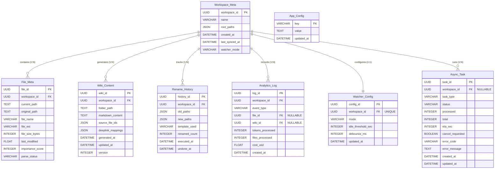

> **관계 요약:** `Workspace_Meta`가 중심 엔티티이며, `File_Meta`·`Wiki_Content`·`Rename_History`·`Analytics_Log`·`Async_Task`와 1:N, `Watcher_Config`와 1:1 관계. `App_Config`는 전역 설정으로 독립.

**DEC-11 — 저장 타입·타임존 규약 (전 테이블 공통, 확정)**

아래 표의 `UUID` / `DATETIME`은 **논리 타입 표기**다. SQLite에는 두 타입이 모두 존재하지 않으므로 물리 저장형을 다음과 같이 확정한다.

| 논리 타입 | 물리 저장형 | 규약 |
|:---|:---|:---|
| `UUID` | **TEXT (하이픈 포함 36자, 소문자)** | `str(uuid.uuid4())` 결과를 그대로 저장한다. BLOB(16바이트)·하이픈 제거 형식을 쓰지 않는다 — 로컬 DB를 직접 열어 조사하는 오프라인 지원 시나리오에서 판독 가능성이 성능보다 중요하다 |
| `DATETIME` | **TEXT (ISO-8601 UTC, `YYYY-MM-DDTHH:MM:SS.ffffffZ`)** | 항상 **UTC**로 저장한다. ISO-8601은 사전순 = 시간순이므로 `ORDER BY`·`BETWEEN` 범위 비교가 문자열 비교만으로 정확히 동작한다 |
| `FLOAT` (`last_modified`) | REAL | OS가 주는 epoch 값이므로 예외적으로 숫자를 유지한다 (`Path.stat().st_mtime`와 직접 비교하는 값) |

**타임존 규약**

- **저장·API 전송은 전부 UTC**다. `datetime.now(timezone.utc)`만 사용하며 naive `datetime.now()`를 쓰지 않는다.
- **KST 변환은 프론트엔드 표시 단계에서만** 수행한다. 백엔드는 로컬 타임존을 알지 못한다.
- 단, `?period=week|month` **기간 경계는 사용자의 로컬 타임존 기준**이어야 자연스럽다("이번 주"는 KST 주). 따라서 프론트엔드가 계산한 **UTC 시각 범위**(`from`/`to`)를 쿼리로 보내고, 백엔드는 그 범위를 그대로 비교한다. 백엔드가 `week`라는 단어를 해석해 경계를 추정하지 않는다.

**`ON UPDATE CURRENT_TIMESTAMP` 대체 (중요)**

`ON UPDATE CURRENT_TIMESTAMP`는 **MySQL 문법이며 SQLite에 존재하지 않는다.** 위 표에서 이 표기가 붙은 컬럼(`Wiki_Content.updated_at`, `Watcher_Config.updated_at`, `App_Config.updated_at`, `Async_Task.updated_at`)은 다음으로 대체한다.

- **Repository의 `UPDATE` 문에서 `updated_at`을 명시적으로 대입한다.** (`SET ..., updated_at = :now`)
- `AFTER UPDATE` 트리거를 사용하지 않는다 — 테이블마다 트리거를 마이그레이션에서 관리해야 하고, 갱신 시점이 코드에서 보이지 않게 숨는다.
- 컬럼 정의는 `TEXT NOT NULL DEFAULT (strftime('%Y-%m-%dT%H:%M:%fZ','now'))` 로 두어 INSERT 시 기본값만 보장한다.
- `DEFAULT CURRENT_TIMESTAMP`도 SQLite에서는 `'YYYY-MM-DD HH:MM:SS'`(공백 구분·소수점 없음·`Z` 없음) 형식을 만들어 위 규약과 어긋난다. **모든 기본값은 `strftime('%Y-%m-%dT%H:%M:%fZ','now')` 로 통일한다.**

#### 6.2.1 Workspace_Meta

| Field Name | Data Type | Constraints | Description |
|:---|:---|:---|:---|
| `workspace_id` | UUID (PK) | Auto Generated, NOT NULL | 워크스페이스 고유 식별자 |
| `name` | VARCHAR(255) | NOT NULL | 유저가 지정한 프로젝트 이름 |
| `root_paths` | JSON | NOT NULL | 병합된 대상 폴더들의 절대 경로 배열 |
| `created_at` | DATETIME | DEFAULT (strftime('%Y-%m-%dT%H:%M:%fZ','now')) (`DEC-11`) | 워크스페이스 생성 시각 |
| `last_synced_at` | DATETIME | NULLABLE | 마지막 위키 갱신(Sync) 시점 |
| `watcher_mode` | VARCHAR(20) | DEFAULT 'off' | Watcher 동작 모드 (manual/realtime/idle/off) |

#### 6.2.2 File_Meta

| Field Name | Data Type | Constraints | Description |
|:---|:---|:---|:---|
| `file_id` | UUID (PK) | Auto Generated, NOT NULL | 개별 파일 식별자 — **모든 딥링크·통계 참조의 유일한 안정적 앵커** (`DEC-08`) |
| `workspace_id` | UUID (FK) | REFERENCES Workspace_Meta, NOT NULL, **ON DELETE CASCADE** | 소속 워크스페이스 (`DEC-09`) |
| `current_path` | TEXT | NOT NULL, UNIQUE per workspace | **현재** OS상의 물리적 절대 경로. Rename·이동 시 이 컬럼만 갱신된다 (`DEC-08`) |
| `original_path` | TEXT | NOT NULL | **최초 스캔 시점**의 절대 경로 (불변). 감사·추적 용도이며 파일 열기에 사용하지 않는다 |
| `file_name` | VARCHAR(255) | NOT NULL | 현재 파일명 (확장자 포함) — `current_path`의 basename과 항상 일치 |
| `file_ext` | VARCHAR(10) | NOT NULL | 확장자 (.docx, .pdf, .txt, .md) |
| `file_size_bytes` | INTEGER | NOT NULL | 파일 크기 (bytes) |
| `last_modified` | FLOAT | NOT NULL | OS 파일 수정 타임스탬프 (epoch) |
| `importance_score` | INTEGER | NULLABLE, 0~100 | 고속 분석 중요도 점수 |
| ~~`vector_ids`~~ | — | **폐기 (`DEC-09`)** | chunk ID를 SQLite에 이중 기록하지 않는다. ID는 `<file_id>:<chunk_index>`로 계산하고, 삭제는 Chroma 메타데이터 필터(`where={"file_id": …}`)로 수행한다 |
| `parse_status` | VARCHAR(20) | DEFAULT 'pending' | 파싱 상태 (pending/parsed/error/skipped) |

#### 6.2.3 Wiki_Content

| Field Name | Data Type | Constraints | Description |
|:---|:---|:---|:---|
| `wiki_id` | UUID (PK) | Auto Generated, NOT NULL | 위키 콘텐츠 고유 식별자 |
| `workspace_id` | UUID (FK) | REFERENCES Workspace_Meta, NOT NULL, **ON DELETE CASCADE** | 소속 워크스페이스 (`DEC-09`) |
| `folder_path` | TEXT | NOT NULL | 1-Depth 폴더 경로 (탭 분리 기준) |
| `markdown_content` | TEXT | NOT NULL | 생성된 마크다운 위키 본문 |
| `source_file_ids` | JSON | NOT NULL | 위키 생성에 사용된 File_Meta ID 목록 |
| `deeplink_mappings` | JSON | NOT NULL | 문장 인덱스 → **`file_id`** 매핑. **절대 경로를 저장하지 않는다** — 경로는 조회 시점에 `File_Meta.current_path`로 late binding 해석한다 (`DEC-08`) |
| `generated_at` | DATETIME | DEFAULT (strftime('%Y-%m-%dT%H:%M:%fZ','now')) (`DEC-11`) | 위키 최초 생성 시각 |
| `updated_at` | DATETIME | NOT NULL, 갱신 시 Repository가 명시 대입 (`DEC-11`) | 위키 최종 갱신 시각 |
| `version` | INTEGER | DEFAULT 1 | 위키 버전 (Merge 시 증가) |

**DEC-08 — 딥링크 앵커링 및 Rename 경로 정합성 (확정)**

Rename(F4)과 딥링크(F5)는 동일한 경로 문자열을 공유하므로, 경로를 위키 본문에 굳히면 **앱 자신의 Rename 기능이 자기 위키의 모든 딥링크를 파괴**한다. 이를 스키마 차원에서 제거한다.

| 결정 항목 | 확정 내용 |
|:---|:---|
| 앵커 형식 | 위키 마크다운 내 유일한 딥링크 앵커는 **`[[file_id:<UUID>]]`** 이다. 절대 경로·파일명·상대 경로를 앵커로 쓰지 않는다. |
| 경로 저장 위치 | 경로는 **`File_Meta` 단일 지점**에만 존재한다. `Wiki_Content.markdown_content` / `deeplink_mappings` / 벡터 메타데이터에는 경로를 저장하지 않는다. |
| Late binding | 딥링크 해석은 **조회 시점**에 `file_id → File_Meta.current_path` 조회로 수행한다. 프론트엔드에서는 `react-markdown`과 커스텀 remark/rehype 플러그인을 사용하여 `[[file_id:UUID]]`를 onClick 이벤트가 바인딩된 앵커 태그로 렌더링한다. 위키 재생성 없이 경로 변경이 즉시 반영된다. |
| 경로 컬럼 분리 | `current_path`(현재 위치, 가변) / `original_path`(최초 스캔 시점, 불변). 파일 열기·존재 검증은 **항상 `current_path`** 를 쓴다. |
| Rename 반영 | `os.rename()` 성공 직후 해당 `File_Meta` 행의 `current_path`·`file_name` **한 행만 UPDATE**. 위키 본문은 건드리지 않는다. |
| Undo 반영 | `Rename_History.old_paths`/`new_paths`는 **OS 레벨 롤백용으로 경로 기반을 유지**한다(디스크 상태 복원에는 실제 경로가 필요). Undo는 `current_path`를 `old_paths` 값으로 되돌린다. |
| Watcher 이동 감지 | `watchdog`의 `FileMovedEvent`도 동일 경로로 처리 — `src_path`로 행을 찾아 `current_path`를 `dest_path`로 갱신한다. 새 파일로 재등록하지 않는다(`file_id` 보존 → 딥링크·통계 유지). |
| REQ-FUNC-022 재정의 | Broken Link = **"DB에 `current_path`가 있으나 디스크에 실물이 없음"**(`Path.exists()` false). 앱 내부 Rename·이동은 정의상 broken을 만들지 않는다. 외부 요인(사용자가 탐색기에서 삭제/이동)만 broken으로 표시된다. |
| 앵커 무효 처리 | `file_id`가 `File_Meta`에 없으면(원문 레코드 삭제) 해당 앵커는 `is_broken: true` + 비활성 렌더링. 위키 본문에서 앵커 텍스트를 제거하지 않는다(위키는 불변 산출물). |

> **주의:** `deeplink_mappings`나 위키 본문에 경로를 캐시해 "조회를 줄이는" 최적화를 넣지 않는다. 그 캐시가 곧 stale 딥링크의 원인이며, `DEC-08`의 전제를 무너뜨린다.

#### 6.2.4 Rename_History

| Field Name | Data Type | Constraints | Description |
|:---|:---|:---|:---|
| `history_id` | UUID (PK) | Auto Generated, NOT NULL | 이름 변경 작업 세션 ID |
| `workspace_id` | UUID (FK) | REFERENCES Workspace_Meta, NOT NULL, **ON DELETE CASCADE** | 소속 워크스페이스 (`DEC-09`) |
| `old_paths` | JSON | NOT NULL | 변경 이전 경로 목록 — **OS 레벨 롤백용이므로 경로 기반 유지** (`DEC-08`). 항목당 `{file_id, path}` 형태로 저장해 Undo 시 대상 행을 특정한다 |
| `new_paths` | JSON | NOT NULL | 변경 이후 경로 목록 (동일 형식) |
| `template_used` | VARCHAR(255) | NULLABLE | 적용된 Naming 템플릿명 |
| `renamed_count` | INTEGER | NOT NULL | 변경된 파일 수 |
| `executed_at` | DATETIME | DEFAULT (strftime('%Y-%m-%dT%H:%M:%fZ','now')) (`DEC-11`) | 실행 시각 |
| `undone_at` | DATETIME | NULLABLE | Undo 실행 시각 (NULL = 미원복) |

#### 6.2.5 Analytics_Log

| Field Name | Data Type | Constraints | Description |
|:---|:---|:---|:---|
| `log_id` | UUID (PK) | Auto Generated, NOT NULL | 로그 고유 식별자 |
| `workspace_id` | UUID (FK) | REFERENCES Workspace_Meta, NOT NULL, **ON DELETE CASCADE** | 소속 워크스페이스 (`DEC-09`) |
| `event_type` | VARCHAR(50) | NOT NULL | 이벤트 유형 (analysis_complete, deeplink_click, watcher_update, rename_execute) |
| `file_id` | UUID (FK) | REFERENCES File_Meta, **NULLABLE**, ON DELETE SET NULL | 대상 파일 — `deeplink_click` 시 어떤 원문을 팩트체크했는지 기록 (`DEC-07`) |
| `wiki_id` | UUID (FK) | REFERENCES Wiki_Content, **NULLABLE**, ON DELETE SET NULL | 대상 위키 — `deeplink_click`이 발생한 위키 탭 (`DEC-07`) |
| `tokens_processed` | INTEGER | NULLABLE | 처리된 토큰 수 (Time Saved 산출용) |
| `files_processed` | INTEGER | NULLABLE | 처리된 파일 수 |
| `cost_usd` | FLOAT | NULLABLE | Option A API 호출 비용 (USD) |
| `created_at` | DATETIME | DEFAULT (strftime('%Y-%m-%dT%H:%M:%fZ','now')) (`DEC-11`) | 이벤트 발생 시각 |

> **인덱스:** `(created_at)` — `?period=week|month|all` 기간 필터용, `(event_type, created_at)` — 지표별 집계용, `(workspace_id)`.

**DEC-07 — My Analytics 지표 산출 방식 (확정)**

`Analytics_Log`는 **누적 이벤트 로그**이고, 압축률은 **현재 스냅샷** 지표다. 성격이 다르므로 산출 소스를 분리한다.

| 지표 (REQ) | 산출 소스 | 산출식 |
|:---|:---|:---|
| 절약 시간 (REQ-FUNC-027) | `Analytics_Log` (기간 필터) | `SUM(tokens_processed) ÷ (250 WPM × 1.3 token/word)` → 분(min) |
| 팩트체크 (REQ-FUNC-028) | `Analytics_Log` (기간 필터) | `COUNT(*) WHERE event_type='deeplink_click'` |
| **압축률 (REQ-FUNC-029)** | **`File_Meta` / `Wiki_Content` 직접 COUNT** | `COUNT(File_Meta WHERE parse_status='parsed') : COUNT(Wiki_Content)` — **기간 필터를 적용하지 않는 현재 상태 지표**. 파일이 삭제되면 값이 즉시 반영되어야 하므로 이벤트 누적으로 산출하지 않는다 |
| 자동화 (REQ-FUNC-030) | `Analytics_Log` (기간 필터) | `COUNT(*) WHERE event_type='watcher_update'` |

- `file_id` / `wiki_id`는 **`deeplink_click`에서만 필수**로 채운다. 다른 이벤트 유형에서는 NULL을 허용한다.
- 두 FK는 `ON DELETE SET NULL`이다 — 원문 파일이나 위키가 삭제되어도 **과거 팩트체크 횟수 집계가 소급 감소하지 않아야** 하기 때문이다.
- `GET /api/v1/analytics/summary` 응답의 `knowledge_ratio`는 압축률 지표이며, `?period` 파라미터의 영향을 받지 않는다는 점을 응답에 명시한다(`knowledge_ratio_scope: "current"`).

> **§6.3.4 시퀀스 정정:** 해당 다이어그램의 `COUNT(DISTINCT file_id) : COUNT(DISTINCT wiki_id)`는 `Analytics_Log`가 아니라 **`File_Meta` / `Wiki_Content` 테이블을 대상으로** 수행한다.

#### 6.2.6 Watcher_Config

| Field Name | Data Type | Constraints | Description |
|:---|:---|:---|:---|
| `config_id` | UUID (PK) | Auto Generated, NOT NULL | 설정 고유 식별자 |
| `workspace_id` | UUID (FK) | REFERENCES Workspace_Meta, UNIQUE, NOT NULL, **ON DELETE CASCADE** | 대상 워크스페이스 (1:1) (`DEC-09`) |
| `mode` | VARCHAR(20) | DEFAULT 'off' | 동작 모드 (manual/realtime/idle/off) |
| `idle_threshold_sec` | INTEGER | DEFAULT 300 | 유휴 판단 임계값 (초) |
| `debounce_ms` | INTEGER | DEFAULT 2000 | 이벤트 디바운싱 대기 시간 (ms) |
| `updated_at` | DATETIME | NOT NULL, 갱신 시 Repository가 명시 대입 (`DEC-11`) | 최종 설정 변경 시각 |

#### 6.2.7 App_Config

전역(워크스페이스 무관) 설정을 담는 단일 KV 테이블.

| Field Name | Data Type | Constraints | Description |
|:---|:---|:---|:---|
| `key` | VARCHAR(100) (PK) | NOT NULL | 설정 키 (예: `llm_mode`, `api_key_encrypted`(DPAPI blob base64 — `DEC-12`), `llm_cloud_model`, `cloud_price_input_per_mtok`, `cloud_price_output_per_mtok`, `embedding_model`, `embedding_dim`, `local_embedding_model`, `local_generation_model`, `provision_mode` — `DEC-13`, `cloud_price_updated_at`, `llm_timeout_connect`, `llm_timeout_read`, `llm_timeout_embedding` — `DEC-16`) |
| `value` | TEXT | NOT NULL | 설정 값 |
| `updated_at` | DATETIME | NOT NULL, 갱신 시 Repository가 명시 대입 (`DEC-11`) | 최종 변경 시각 |

**DEC-10 — 전역 설정 테이블명 (확정)**

전역 설정 테이블의 이름은 **`App_Config` 단일안**이다. 초안에 등장했던 **`Settings_Meta`는 폐기**하며, 어떤 문서·코드·마이그레이션에서도 사용하지 않는다.

- 근거: `*_Meta` 접미사는 이 스키마에서 **엔티티의 메타데이터**(`Workspace_Meta`, `File_Meta`)를 뜻한다. 전역 KV 설정은 엔티티가 아니므로 `App_Config`가 의미상 정확하고, SRS 스키마·ERD·`DEC-06` 임베딩 가드가 이미 이 이름을 쓴다.
- 설정을 목적별로 여러 테이블(`Llm_Config` 등)로 분리하지 않는다. 키 네임스페이스(`llm_*`, `embedding_*`)로 구분한다.

#### 6.2.8 Async_Task

`DEC-04`(비동기 실행 모델)에 따라 장기 작업의 진행률과 결과를 영속화한다. 이 테이블이 REQ-NF-011(RPO/RTO)을 만족하는 근거다.

| Field Name | Data Type | Constraints | Description |
|:---|:---|:---|:---|
| `task_id` | UUID (PK) | Auto Generated, NOT NULL | 작업 고유 식별자 (202 응답으로 반환) |
| `workspace_id` | UUID (FK) | REFERENCES Workspace_Meta, NULLABLE, **ON DELETE CASCADE** | 소속 워크스페이스 (`llm/onboard`는 NULL) |
| `task_type` | VARCHAR(30) | NOT NULL | `scan` / `analyze_fast` / `analyze_deep` / `llm_onboard` / `rename_apply` / `rename_undo` |
| `status` | VARCHAR(20) | NOT NULL, DEFAULT 'queued' | `queued` / `running` / `succeeded` / `failed` / `cancelled` / `interrupted` |
| `processed` | INTEGER | NOT NULL, DEFAULT 0 | 처리 완료 항목 수 |
| `total` | INTEGER | NOT NULL, DEFAULT 0 | 전체 항목 수 (0 = 산정 전) |
| `eta_sec` | INTEGER | NULLABLE | 잔여 예상 시간 (초) |
| `cancel_requested` | BOOLEAN | NOT NULL, DEFAULT 0 | 협조적 취소 플래그 |
| `error_code` | VARCHAR(40) | NULLABLE | 실패 시 `DEC-03` 표준 에러 코드 |
| `error_message` | TEXT | NULLABLE | 실패 사유 (스택트레이스는 로그에만) |
| `created_at` | DATETIME | DEFAULT (strftime('%Y-%m-%dT%H:%M:%fZ','now')) (`DEC-11`) | 접수 시각 |
| `updated_at` | DATETIME | NOT NULL, 갱신 시 Repository가 명시 대입 (`DEC-11`) | 최종 진행률 갱신 시각 (7일 경과 정리 기준) |

> **인덱스:** `(status)` — 부팅 시 좌초 task 조회용, `(workspace_id, task_type)` — 중복 실행 방지 검사용.

### 6.3 Detailed Interaction Models

#### 6.3.1 상세 시퀀스: Batch Rename 실행 및 Undo 플로우

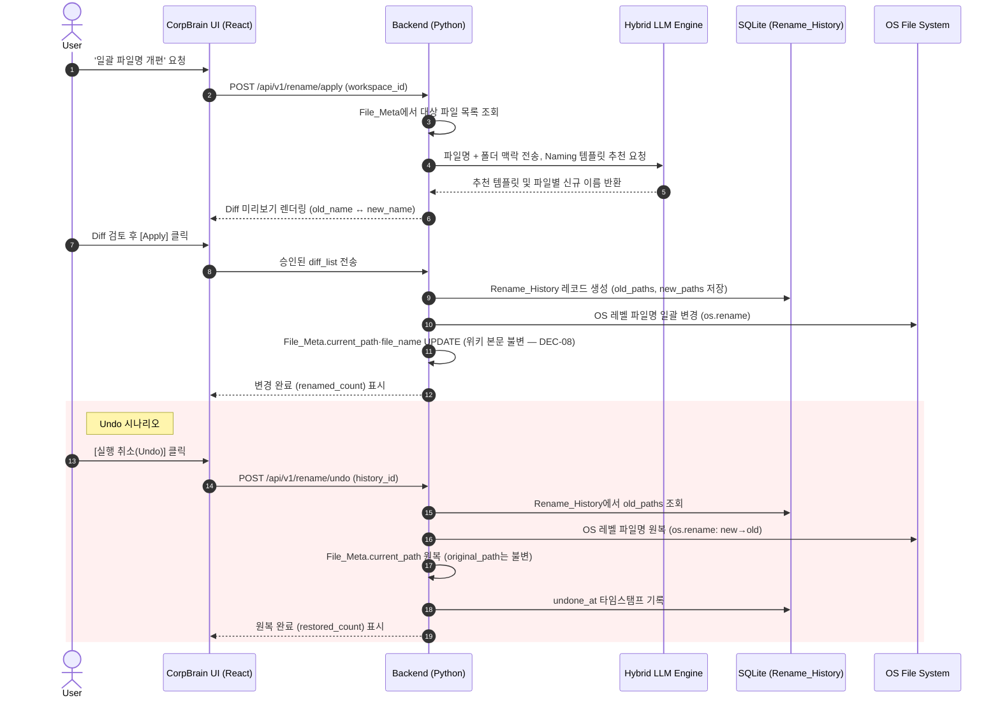

#### 6.3.2 상세 시퀀스: Ollama 프로비저닝 (준비 단계)

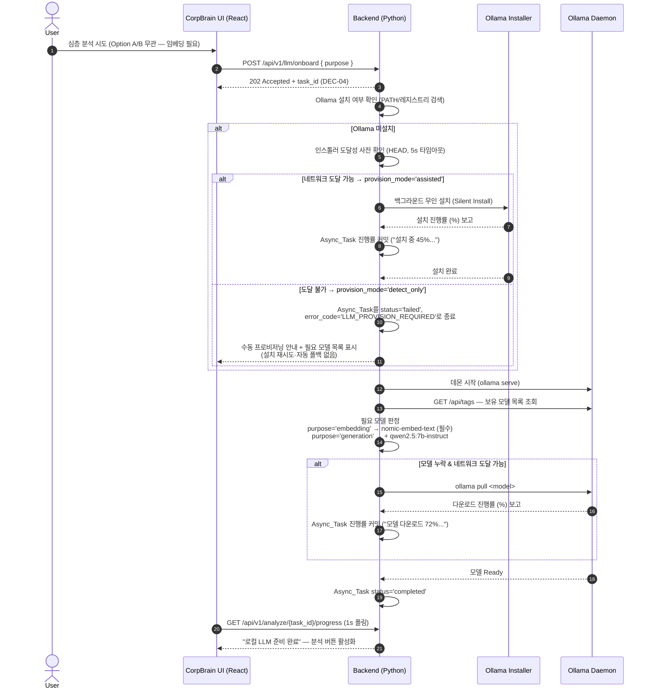

**DEC-13 — Ollama 모델 확정 및 폐쇄망 프로비저닝 모델 (확정)**

`REQ-FUNC-010`(인스톨러·모델 다운로드)과 `CON-03`/`REQ-NF-005`(폐쇄망·Telemetry 원천 배제)는 **동일 문장 안에서 모순**이었다. 모순의 실체는 기능이 아니라 요구사항 문장의 부정확함이므로, **"준비(provisioning) 단계"와 "정상 상태(steady state)"를 명시적으로 분리**해 해소한다.

| 항목 | 결정 |
|:---|:---|
| **모델 2종 역할 분리** | **임베딩: `nomic-embed-text`** (768차원, 약 274MB) — `DEC-06`에 따라 **Option A/B 무관 전원 필수**. **생성: `qwen2.5:7b-instruct`** (약 4.7GB) — **Option B 전용**. 온보딩 UI는 두 모델을 하나의 덩어리로 묶어 표시하지 않는다 |
| 생성 모델 선정 근거 | 7B 급은 16GB RAM 사무용 PC에서 CPU 추론이 실사용 가능한 상한이고, `qwen2.5-instruct`는 한국어 지시 이행과 32K 컨텍스트(위키 생성용 청크 묶음)를 동시에 만족한다. 13B 이상은 CON-05(유휴 리소스 최소화)와 충돌 |
| 모델 ID 보관 | `App_Config`의 `local_embedding_model` / `local_generation_model` 키. **코드 하드코딩 금지** (`DEC-10`·`DEC-12`와 동일 원칙) |
| **프로비저닝 2모드** | `assisted` — 인스톨러 도달 가능 시 무인 설치 + `ollama pull`. `detect_only` — **폐쇄망: 관리자가 사전 설치한 Ollama를 탐지만 하고 설치·다운로드를 시도하지 않는다.** 모드는 `POST /api/v1/llm/onboard` 시점에 인스톨러 도달성 사전 확인(HEAD, 5초 타임아웃)으로 자동 판정하며, `Async_Task.result_json.provision_mode`에 기록한다 |
| 폐쇄망 실패 처리 | 다운로드 실패는 **재시도·무한 대기 없이** `Async_Task.status='failed'` + `error_code='LLM_PROVISION_REQUIRED'`로 즉시 종료하고, UI에 **필요 모델 목록과 오프라인 설치 절차**를 표시한다. 폐쇄망은 예외가 아니라 **A1 페르소나의 기본 환경**이므로 "다운로드 중" 상태에서 멎는 것은 결함이다 |
| 사전 프로비저닝 경로 | 문서화된 수동 절차: 관리자 PC에서 Ollama 설치 후 `ollama pull` → `%USERPROFILE%\.ollama\models` 디렉터리를 대상 PC로 복사 → CorpBrain은 `GET /api/tags`로 존재만 확인. **앱이 모델 파일을 자체 포맷으로 재배포하거나 exe에 번들하지 않는다** (CON-02) |
| **REQ-NF-005 정밀화** | 금지 대상은 **분석 대상 문서의 내용·경로·사용 로그의 외부 전송**이다. 준비 단계의 **바이너리 취득**(인스톨러·모델 가중치)은 사용자가 명시적으로 개시하는 별개 행위이며 문서 데이터를 포함하지 않는다. 이 구분을 문서에 명시해야 A1의 보안 검토 대상이 명확해진다 |
| 검증 기준 | TC-SEC-002는 **프로비저닝 완료 후 정상 상태**에서 측정한다. Option B 정상 상태의 외부 통신은 **0건**이어야 하며, `127.0.0.1` 외 목적지가 1건이라도 나오면 실패다 |
| 근거 | "완전 오프라인"은 **정상 상태의 속성**이지 설치 시점의 속성이 아니다. 두 시점을 구분하지 않으면 Must 요구사항(REQ-FUNC-010)과 보안 제약(CON-03) 중 하나를 반드시 폐기해야 하지만, 구분하면 둘 다 성립한다 |

> **주의:** `detect_only` 모드에서 "사용자 편의를 위해" 설치를 자동 재시도하거나, 폐쇄망에서 Option A로 조용히 폴백하지 않는다. 후자는 문서 내용을 사용자 동의 없이 외부로 내보내는 행위다.

**DEC-12 — Option A 클라우드 프로바이더·모델 및 API 키 보관 (확정)**

| 항목 | 결정 |
|:---|:---|
| 프로바이더 | **Anthropic 단일**. MVP에서 프로바이더 2종은 기능이 아니라 검증 부채다(단가표·토큰 계수·에러 매핑·Health Check가 각각 2배). OpenAI를 **동시 지원하지 않는다** |
| 모델 | **`claude-sonnet-5`** (심층 분석/위키 생성). 모델 ID는 `App_Config`의 `llm_cloud_model` 키로 보관해 코드 하드코딩을 피한다 |
| 확장 seam | `LLMRouter` 내부에 **프로바이더 어댑터 인터페이스**(`generate()` / `health_check()` / `estimate_cost()`)만 정의해 둔다. 구현체는 Anthropic 1개 + Ollama 1개. 어댑터가 있으면 후속 프로바이더 추가 비용이 거의 같으므로 지금 2개를 만들지 않는다 |
| SDK | 공식 `anthropic` 파이썬 SDK. 승인 의존성에 추가한다 |
| API 키 입력 | 사용자가 설정 화면에서 직접 입력한다 (ASM-04). 앱이 키를 발급·중계하지 않는다 |
| **키 암호화 방식** | **Windows DPAPI** (`CryptProtectData` / `CryptUnprotectData`, `ctypes`로 호출 — **신규 의존성 0**). 암호화 키는 **OS가 현재 사용자 계정에 묶어 관리**하므로 애플리케이션이 마스터 키를 보관하지 않는다 |
| 저장 위치 | DPAPI blob을 base64로 인코딩해 `App_Config`의 `api_key_encrypted` 키에 저장. 복호화는 **호출 직전 메모리에서만** 수행하고 즉시 폐기한다 |
| 금지 사항 | 코드에 마스터 키 하드코딩, 머신 고정 문자열 기반 KDF, 평문 저장, 환경변수·로그·에러 응답·크래시 리포트에 키 노출 **전부 금지**. 이들은 암호화가 아니라 인코딩이며 REQ-NF-006/CON-03 아래에서 방어할 수 없다 |
| 이식성 트레이드오프 | DPAPI blob은 **다른 Windows 사용자 계정·다른 PC에서 복호화되지 않는다.** 이는 결함이 아니라 의도된 보안 속성이다(DB 파일만 유출돼도 키는 쓸 수 없다). 계정 이전 시 사용자가 키를 재입력하도록 안내하며, 복호화 실패는 **키 재입력 유도**로 처리하고 조용히 무시하지 않는다 |
| 비용 산출 (REQ-NF-016) | 단가는 `App_Config`의 `cloud_price_input_per_mtok` / `cloud_price_output_per_mtok`에 **사용자가 확인 가능한 값으로 보관**하고, API 응답의 `usage.input_tokens`/`usage.output_tokens` 실측치와 곱해 `Analytics_Log.cost_usd`에 기록한다. 단가를 코드에 하드코딩하지 않는다 — 공식 가격은 변동하며, 하드코딩된 낡은 단가는 **틀린 비용을 확신 있게 표시**하는 최악의 실패 형태다 |
| 근거 | 프로바이더 1종으로 REQ-NF-016 검증 범위를 절반으로 줄이고, DPAPI로 "로컬 앱은 비밀을 안전히 보관할 수 없다"는 근본 난제를 OS에 위임한다 |

**DEC-16 — LLM 호출 실패·타임아웃 정책 및 비용 단가 출처 (확정)**

`REQ-NF-010`은 "LLM이 죽어도 조회 기능은 살아야 한다"만 규정하고, **분석 도중 개별 호출이 실패했을 때 무엇을 하는지**는 정의하지 않았다. `DEC-13`은 폐쇄망에서의 Option A 폴백만 금지했다. 재시도 횟수·타임아웃 값·부분 실패 처리도 비어 있었고, `REQ-NF-016`의 단가는 `DEC-12`가 `App_Config`로 보냈지만 **최초 값의 출처**가 없었다.

| 항목 | 결정 |
|:---|:---|
| **엔진 자동 전환** | **금지.** Option A 실패 시 Option B로(또는 그 역으로) 자동 전환하지 않는다. Option A/B 선택은 성능 선택이 아니라 **보안 결정**이며, 자동 전환은 사용자가 승인한 전제(문서가 외부로 나가는지 여부, 품질, 비용, 소요 시간)를 동의 없이 바꾼다. 하나의 위키에 두 모델 출력이 섞이면 산출물의 성격도 설명할 수 없게 된다. 엔진 변경은 **설정 화면의 명시적 선택으로만** 이루어진다 |
| 재시도 대상 | **일시적 오류만** 재시도한다 — HTTP `429`, `5xx`, 연결·읽기 타임아웃. `401`(키 무효), `400`(요청 오류), `EgressBlockedError`(`DEC-15`), `PII_MASKING_FAILED`(`DEC-14`)는 **재시도하지 않는다**. 재시도해도 결과가 같은 오류를 반복 호출하는 것은 비용과 시간만 쓴다 |
| 재시도 방식 | **최대 3회, 지수 백오프**(1s → 2s → 4s, 지터 포함). `429` 응답에 `retry-after` 헤더가 있으면 그 값을 우선한다. **무한 재시도 루프를 만들지 않는다** (`DEC-13`과 동일 원칙) |
| 타임아웃 | 연결 10초 / 읽기 **120초**(생성 계열), Health Check는 5초, 임베딩 호출은 30초. 값은 `App_Config`(`llm_timeout_*`)에 두어 저사양 PC의 로컬 추론 지연을 사용자가 조정할 수 있게 한다 |
| **부분 실패 처리** | 재시도 소진 후에는 **해당 파일 1개만 실패로 기록하고 작업은 다음 파일로 진행**한다. `Async_Task`의 파일별 커밋(`DEC-04`)에 실패 건을 누적하고, 최종 응답은 **HTTP 207 + `ok:true` + `data.failed[]`**(`DEC-03`)로 반환한다. 실패 항목에는 `file_id`와 `error.code`를 담고 **원문 청크·프롬프트는 담지 않는다** |
| 전체 실패 판정 | 작업 시작 시점의 Health Check가 실패하거나 **연속 실패가 10건에 도달**하면 남은 파일을 처리하지 않고 `status='failed'` + `error_code='LLM_UNAVAILABLE'`로 종료한다. 데몬이 내려간 상태에서 1,000개 파일을 각각 3회 재시도하는 것은 사용자를 기다리게 만드는 것 외에 아무 일도 하지 않는다 |
| 실패 파일 재처리 | 실패 파일은 `File_Meta.parse_status`를 `parsed`로 올리지 않는다. 따라서 사용자가 재분석을 실행하면 **성공한 파일은 건너뛰고 실패 파일만** 다시 처리된다(`DEC-04` 재개 멱등성과 동일 메커니즘). 별도의 재시도 큐를 만들지 않는다 |
| **단가 초기값 출처** | `App_Config`의 `cloud_price_input_per_mtok` / `cloud_price_output_per_mtok`는 **마이그레이션 시드값**으로 주입하고(`migrations/vNNN_*.sql`), `cloud_price_updated_at`에 **기준일**을 함께 저장한다. 설정 화면에서 사용자가 직접 편집할 수 있고, UI는 비용 표시 옆에 "기준일 YYYY-MM-DD 단가 기준 추정치"를 병기한다 |
| 단가 자동 갱신 | **하지 않는다.** 가격표를 주기적으로 조회하는 것은 `DEC-15`의 네 번째 목적지가 되며, REQ-NF-005의 허용 통신 2종을 늘린다. 단가는 사용자가 갱신하는 값이다 |
| 비용의 성격 | 표시되는 비용은 **실측 `usage` 토큰 × 사용자 보유 단가**이므로 **추정치**다. 이를 "실제 청구액"으로 표기하지 않는다 — 단가가 낡았을 때 앱이 확신 있게 틀린 금액을 말하게 된다 |
| 로컬(Option B) 실패 | Ollama가 도중에 죽으면 같은 재시도·부분 실패 규칙을 적용한다. **비용은 0으로 기록**하며 `Analytics_Log.cost_usd`에 `NULL`이 아닌 `0`을 넣어 "비용 미측정"과 "비용 없음"을 구분한다 |

> **주의:** "사용자를 기다리게 하지 않으려고" 실패한 파일을 조용히 건너뛰고 `ok:true`·200으로 반환하지 않는다. 부분 실패가 성공으로 보이면 사용자는 **위키에 빠진 문서가 있다는 사실을 모른 채** 그것을 신뢰한다. 207과 `data.failed[]`는 이 침묵을 막기 위한 장치다.

#### 6.3.3 상세 시퀀스: PII 마스킹 및 Cloud API 전송 (Option A)

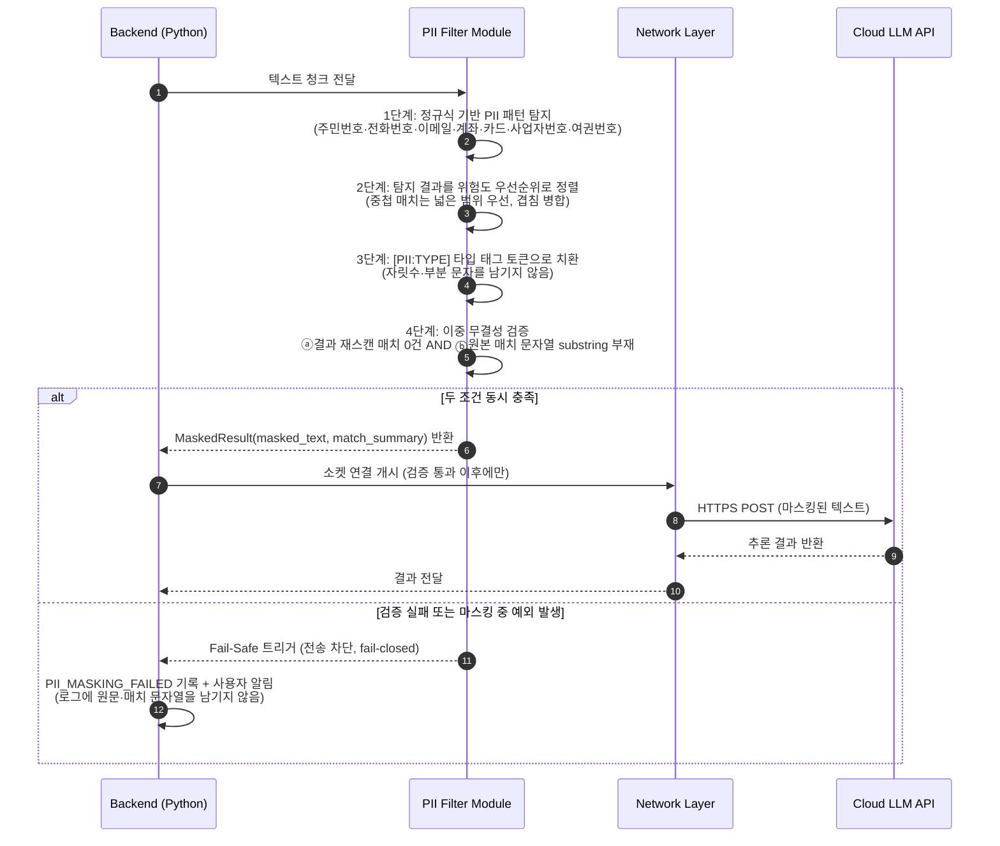

**DEC-14 — PII 마스킹 범위·토큰 형식·무결성 판정 기준 (확정)**

초안의 `2단계: NER 모델 기반 고유명사 탐지`는 **`DEC-06`이 금지한 인프로세스 ML 스택**(spaCy·transformers)을 전제하므로 그대로는 구현 불가능한 Must였다. 또한 마스크 토큰이 `[MASKED]`(SRS)와 `***-****-****`(`LLM-CMD-02`)로 갈렸고, 4단계 "무결성 검증"의 **판정 기준이 정의되지 않아** 같은 정규식을 두 번 돌리는 자기충족 검증이 될 수 있었다.

| 항목 | 결정 |
|:---|:---|
| **탐지 범위** | **정규식 전용**. MVP 탐지 대상은 **주민등록번호, 전화번호(휴대/유선), 이메일, 계좌번호, 신용카드번호, 사업자등록번호, 여권번호** 7종으로 한정한다 |
| **NER** | **MVP 범위 외**로 명시한다. `PIIFilter._ner_scan()`은 **인터페이스만 남기고 no-op**으로 구현하며, `DEC-06`(torch·sentence-transformers 번들 금지)·CON-02를 이유로 어떤 인프로세스 NER 모델도 도입하지 않는다. 확률적 탐지기는 통과/실패 기준을 세울 수 없어 REQ-FUNC-009의 Fail-Safe와 원리적으로 양립하지 않는다 |
| **마스크 토큰 형식** | **`[PII:TYPE]` 타입 태그** — `[PII:RRN]`, `[PII:PHONE]`, `[PII:EMAIL]`, `[PII:ACCOUNT]`, `[PII:CARD]`, `[PII:BIZNO]`, `[PII:PASSPORT]`. `[MASKED]` 단일 토큰과 `***-****-****`는 **모두 폐기**한다 |
| 토큰 형식 근거 | 타입을 남기면 LLM이 "여기에 전화번호가 있었다"는 문맥을 유지해 요약 품질이 보존된다. 반면 `***-****-****`는 **자릿수라는 부분 정보를 유출**하며, 마스크가 연달아 나오면 문장 구조가 붕괴한다 |
| **무결성 판정 기준 (2조건 AND)** | ⓐ **재스캔 판정**: 마스킹 결과에 동일 정규식 세트를 다시 적용해 **매치 0건**. ⓑ **잔존 판정**: 1단계에서 탐지된 **각 원본 매치 문자열이 결과에 substring으로 존재하지 않음**. **두 조건을 동시에 만족할 때만 통과**한다 |
| 판정 기준 근거 | ⓐ만으로는 치환 로직 버그(오프셋 오류로 일부만 치환)를 잡지 못하고, ⓑ만으로는 새로 생성된 PII 패턴을 놓친다. 두 방향을 함께 봐야 검증이 자기충족을 벗어난다 |
| **Fail-closed** | 마스킹·검증 경로의 **모든 예외는 전송 차단**으로 귀결된다 (`PII_MASKING_FAILED`, HTTP 500). "검증을 못 했으니 통과"는 금지다. `bare except`를 쓰지 않고 구체 예외를 포착해 로깅한다 |
| **로그 위생** | 매치된 원본 PII 문자열·원문 청크를 **로그·에러 응답·`Analytics_Log`에 기록하지 않는다.** 기록 가능한 것은 **타입별 매치 건수**(`{"PHONE": 2, "EMAIL": 1}`)뿐이다. 마스킹 로그가 PII 저장소가 되는 것이 가장 흔한 자기 배반이다 |
| 중첩 매치 처리 | 두 패턴이 겹치면 **넓은 범위를 우선**하고 겹침 구간을 병합해 단일 토큰으로 치환한다. 문자열 뒤에서 앞 방향으로 치환해 오프셋이 밀리지 않게 한다 |
| ReDoS 방어 | 모든 패턴에서 중첩 수량자를 배제하고, 청크 길이 상한(REQ 청크 크기)을 전제로 검증한다. 사용자 입력으로 패턴을 조립하지 않는다 |
| **미탐(RSK-03) 보완** | 인명·기관명은 정규식으로 잡히지 않는다. 이를 숨기지 않고 **Option A 최초 전송 전에 마스킹 결과 미리보기와 명시적 동의**를 요구하며(ASM-04 연계), 설정 화면에 "인명·기관명은 자동 마스킹되지 않는다"를 고정 문구로 표시한다 |
| 근거 | 마스킹은 **결정론적으로 검증 가능해야** Fail-Safe가 의미를 갖는다. 확률적 탐지기를 넣으면 "몇 %를 잡았는지" 밖에 말할 수 없고, 보안 검토자(A1)에게 제시할 통과 기준이 사라진다 |

> **주의:** `_ner_scan()`을 "나중에 채우겠다"며 spaCy·transformers를 추가하지 않는다. NER이 필요하다고 판단되면 그것은 의존성 추가가 아니라 **`DEC-06`·CON-02 재검토가 필요한 별개 결정**이다.

**DEC-17 — Rename 추천 프롬프트의 PII 마스킹 및 경로 전송 범위 (확정)**

`DEC-14`의 마스킹 파이프라인은 §6.3.3의 **심층 분석 청크 전송 경로만** 기술했으나, `RenameManager → LLMRouter`(REQ-FUNC-016)는 **두 번째 클라우드 전송 경로**다. 파일명은 `홍길동_주민등록증_900101-1234567.pdf`처럼 그 자체가 PII일 수 있고, 절대 경로는 Windows 계정명과 조직 구조를 노출한다. `DEC-13`이 정밀화한 REQ-NF-005는 **문서 내용과 파일 경로**를 함께 금지하므로, 마스킹을 우회하는 경로를 남겨두는 것은 곧 유출 경로를 남기는 것이다.

| 항목 | 결정 |
|:---|:---|
| **마스킹 게이트** | **`DEC-14`의 `PIIFilter`를 그대로 재사용한다.** Rename 전용 마스킹 로직·전용 토큰 형식·전용 예외 처리를 **새로 만들지 않는다**. 정규식 7종, `[PII:TYPE]` 토큰, `validate_integrity()` 2조건 AND, fail-closed(`PII_MASKING_FAILED`), 로그 위생이 모두 동일하게 적용된다 |
| 적용 지점 | `LLMRouter`가 **Option A(클라우드)로 나가는 모든 프롬프트**에 마스킹을 적용한다. "청크인지 파일명인지"로 분기하지 않는다 — 분기가 곧 우회 지점이 된다. Option B(로컬 `127.0.0.1`)는 외부 전송이 아니므로 마스킹 대상이 아니다 |
| **전송 경로 범위** | **절대 경로를 절대 전송하지 않는다.** 프롬프트에 담을 수 있는 것은 **파일명 + 확장자 + 1-depth 폴더명 + 뎁스 수치**뿐이다. `File_Meta.current_path`·`original_path`의 전체 문자열, 드라이브 문자, 사용자 홈 경로(`C:\Users\<name>`), UNC 서버명은 프롬프트에 넣지 않는다 (`DEC-08`이 위키 본문에 경로를 금지한 것과 동일 원칙) |
| 1-depth 폴더명 허용 근거 | 심층 분석 벡터 메타데이터가 이미 `folder_1depth`를 사용하며(`DEC-06`), 네이밍 맥락 추론에 필요한 최소 단위다. 조직 전체 트리를 재구성할 만한 정보는 아니다 |
| 마스킹의 부수 효과 | 파일명에 PII가 있으면 마스킹된 형태(`[PII:RRN]`)로 전송되므로, LLM이 돌려주는 추천 이름에도 원본 PII가 들어갈 수 없다. **결과적으로 추천 이름이 정화된다** — 이는 부작용이 아니라 바람직한 동작이다 |
| 추천 결과의 토큰 잔존 | LLM 응답에 `[PII:TYPE]` 토큰이 그대로 남아 있으면 **파일명으로 사용하지 않는다.** 해당 파일은 추천 대상에서 제외하고 Diff 목록에 "PII 포함 — 수동 확인 필요"로 표시한다. 원본 PII를 되살려 채워 넣는 역치환(un-masking)은 **금지**한다 |
| 파일명 안전성 검증 | 추천 이름은 Windows 금지 문자(`\ / : * ? " < > |`)·예약어(`CON`, `PRN`, `NUL`, `COM1`…)·후행 공백·마침표를 거부하고, `MAX_PATH`(260자) 초과를 사전 차단한다 (REQ-NF-007). 이는 마스킹과 별개인 필수 검증이다 |
| 통신 경로 | 다른 모든 외부 호출과 동일하게 **`NetworkGuard`(`purpose='llm_cloud'`)** 를 경유한다 (`DEC-15`). Rename 전용 HTTP 클라이언트를 만들지 않는다 |
| 실패 정책 | 마스킹 실패는 fail-closed로 전송 차단(`PII_MASKING_FAILED`), LLM 호출 실패는 `DEC-16`의 재시도·부분 실패 규칙을 따른다. 추천을 못 받은 파일은 Diff 목록에서 제외되며 **원래 이름이 유지된다** |
| 근거 | 파일명은 문서 텍스트의 부분집합이므로 별도 정책을 만들 이유가 없다. 게이트를 하나로 유지하면 `INF-TEST-02`(TC-SEC-002)의 검증 대상도 하나로 유지되고, "어느 경로는 마스킹을 안 거친다"는 예외가 문서에 남지 않는다 |

> **주의:** "파일명은 짧아서 PII가 있을 리 없다"거나 "경로는 내용이 아니다"라는 이유로 마스킹을 건너뛰지 않는다. `홍길동_연봉계약서_2026.docx` 한 줄에는 **이름·문서 성격·시점**이 함께 들어 있고, 이것은 문서 본문 한 문장보다 밀도가 높다.

#### 6.3.4 상세 시퀀스: My Analytics 통계 산출

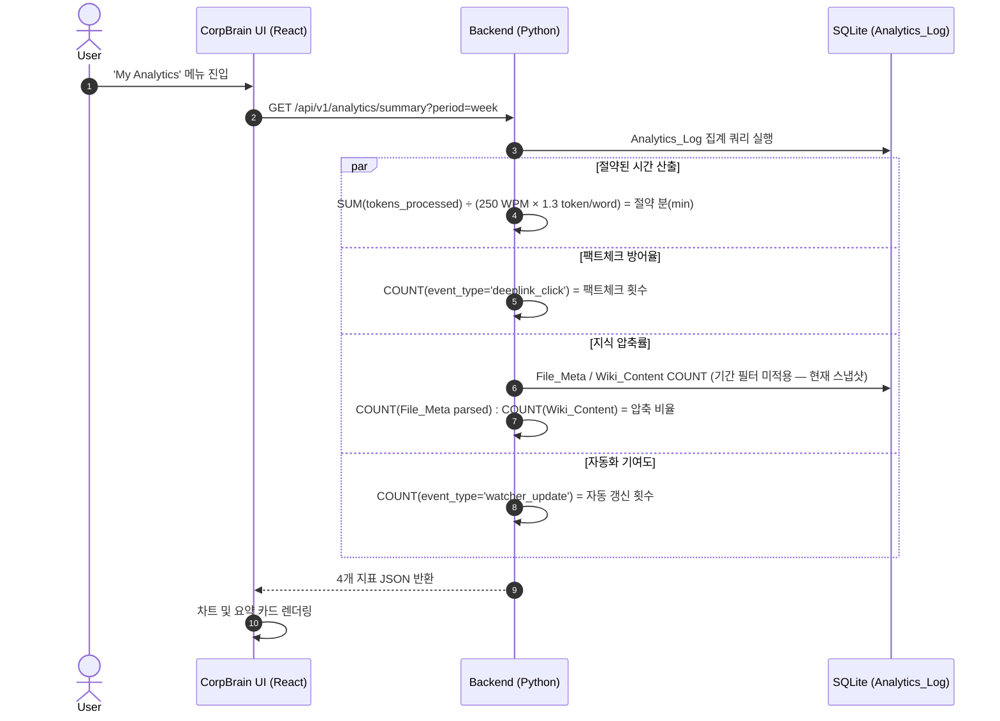

#### 6.3.5 상세 시퀀스: Watcher 유휴시간(Idle) 모드 동작

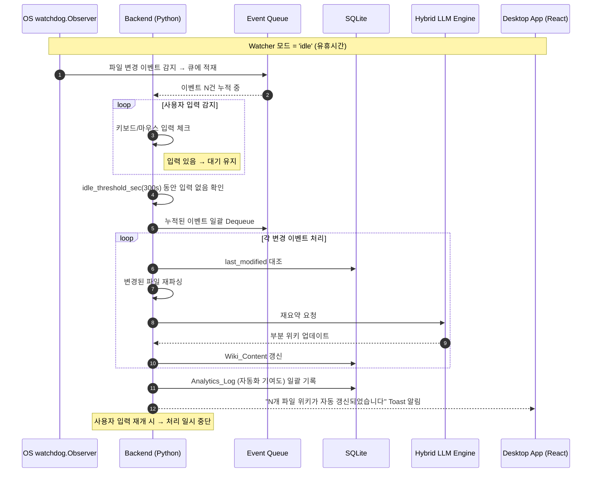

### 6.4 Class Diagram (핵심 모듈 구조)

CorpBrain 백엔드(Python Core)의 핵심 클래스와 의존 관계를 명시한다.

```mermaid
classDiagram
    direction TB

    class WorkspaceManager {
        +create(name: str, paths: list) UUID
        +delete(workspace_id: UUID) bool
        +get(workspace_id: UUID) WorkspaceDTO
        +list_all() list~WorkspaceDTO~
        -_validate_paths(paths: list) bool
    }

    class FileScanner {
        +scan(workspace_id: UUID) ScanResult
        +is_blacklisted(path: str) bool
        +is_supported_format(ext: str) bool
        -_walk_tree(root: str) Generator
        -BLACKLIST: list~str~
        -SUPPORTED_EXT: list~str~
        -MAX_FILE_COUNT: int = 10000
    }

    class TextParser {
        +parse(file_path: str) ParsedText
        +parse_docx(path: str) str
        +parse_pdf(path: str) str
        +parse_txt(path: str) str
        +parse_md(path: str) str
        +chunk(text: str, size: int) list~Chunk~
    }

    class AnalysisEngine {
        +analyze_fast(workspace_id: UUID) FastResult
        +analyze_deep(workspace_id: UUID) DeepResult
        +get_progress(task_id: UUID) ProgressDTO
        -_score_importance(files: list) list~ScoredFile~
        -_generate_wiki(chunks: list) str
        -_map_deeplinks(wiki: str, sources: list) dict
    }

    class LLMRouter {
        +infer(mode: str, prompt: str) InferResult
        +health_check() HealthStatus
        +estimate_cost(usage: TokenUsage) float
        -_route_to_cloud(prompt: str) str
        -_route_to_local(prompt: str) str
        -_retry_transient(fn: Callable) InferResult
        -_is_transient(err: Exception) bool
    }
    note for LLMRouter "DEC-16: 재시도는 429/5xx/타임아웃만 최대 3회 지수 백오프.<br/>401/400/EgressBlocked/PII_MASKING_FAILED는 재시도하지 않는다.<br/>재시도 소진 시 해당 파일만 실패 처리하고 엔진을 자동 전환하지 않는다.<br/>estimate_cost는 실측 usage × App_Config 단가 = 추정치."

    class NetworkGuard {
        +request(purpose: str, url: str, **kwargs) Response
        +stream(purpose: str, url: str, **kwargs) Iterator
        +is_reachable(purpose: str, url: str) bool
        -_assert_allowed(purpose: str, url: str) void
        -_ALLOWED: dict~str, frozenset~str~~
    }
    note for NetworkGuard "DEC-15: 모든 outbound 통신의 단일 관문.<br/>purpose는 llm_local | llm_cloud | provisioning 셋뿐이고,<br/>_ALLOWED는 코드 상수(설정·환경변수에서 읽지 않음).<br/>호스트 exact match 판정, 위반 시 EgressBlockedError로 요청 자체를 만들지 않는다.<br/>이 모듈 외에서 httpx/requests/socket/urllib 직접 import는 CI 린트로 차단."

    class PIIFilter {
        +mask(text: str) MaskedResult
        +validate_integrity(masked: str, matches: list~PIIMatch~) bool
        -_regex_scan(text: str) list~PIIMatch~
        -_ner_scan(text: str) list~PIIMatch~
        -_merge_overlaps(matches: list~PIIMatch~) list~PIIMatch~
        -_replace_tokens(text: str, matches: list) str
    }
    note for PIIFilter "DEC-14: 정규식 전용 7종.<br/>_ner_scan()은 인터페이스만 남긴 no-op — MVP 범위 외.<br/>토큰 형식 [PII:TYPE]. validate_integrity는 2조건 AND 판정.<br/>MaskedResult는 원본 PII를 보관하지 않고 타입별 건수만 요약한다."

    class WatcherDaemon {
        +start(workspace_id: UUID) void
        +stop() void
        +set_mode(mode: str) void
        +get_status() WatcherStatus
        -_on_file_event(event: FSEvent) void
        -_debounce(event: FSEvent) void
        -_check_idle() bool
    }

    class RenameManager {
        +recommend(workspace_id: UUID) list~RenameDiff~
        +apply(diff_list: list) HistoryID
        +undo(history_id: UUID) UndoResult
        -_build_prompt_context(files: list) list~NameContext~
        -_validate_win_filename(name: str) bool
        -_execute_os_rename(old: str, new: str) bool
    }
    note for RenameManager "DEC-17: 추천 프롬프트도 PIIFilter를 그대로 거친다(전용 마스킹 로직 없음).<br/>_build_prompt_context는 파일명·확장자·1-depth 폴더명·뎁스만 담고 절대 경로를 넣지 않는다.<br/>응답에 [PII:TYPE] 토큰이 남으면 파일명으로 쓰지 않고 수동 확인 대상으로 표시한다(역치환 금지).<br/>_validate_win_filename은 금지문자·예약어·MAX_PATH를 사전 차단한다."

    class DeepLinkBridge {
        +open_file(file_id: UUID) bool
        +check_exists(file_id: UUID) bool
        -_resolve_current_path(file_id: UUID) str
        -_os_startfile(path: str) void
    }
    note for DeepLinkBridge "DEC-08: 호출자가 경로를 전달하지 않는다.<br/>경로는 file_id → File_Meta.current_path로 서버에서 해석한다."

    class AnalyticsService {
        +get_summary(period: str) AnalyticsSummary
        +log_event(event: AnalyticsEvent) void
        -_calc_time_saved(tokens: int) float
        -_calc_compression_ratio(ws_id: UUID) float
    }

    class DatabaseManager {
        +get_connection() Connection
        +execute(query: str, params: dict) Result
        +transaction() ContextManager
        -_db_path: str
    }

    class VectorDBManager {
        +upsert(chunks: list~Chunk~) list~str~
        +delete(ids: list~str~) void
        +query(embedding: list, top_k: int) list~Match~
        -_collection: ChromaCollection
    }

    WorkspaceManager --> FileScanner : uses
    WorkspaceManager --> DatabaseManager : persists
    FileScanner --> TextParser : delegates parsing
    AnalysisEngine --> TextParser : extracts text
    AnalysisEngine --> LLMRouter : requests inference
    AnalysisEngine --> VectorDBManager : stores embeddings
    AnalysisEngine --> DatabaseManager : saves wiki
    LLMRouter --> PIIFilter : masks before cloud
    LLMRouter --> NetworkGuard : all egress via single gate (DEC-15)
    VectorDBManager --> NetworkGuard : embedding call (purpose=llm_local)
    WatcherDaemon --> AnalysisEngine : triggers re-analysis
    WatcherDaemon --> DatabaseManager : checks timestamps
    RenameManager --> DatabaseManager : logs history
    RenameManager --> LLMRouter : gets naming suggestions
    DeepLinkBridge --> DatabaseManager : resolves mappings
    AnalyticsService --> DatabaseManager : aggregates logs
```

---

*— End of Document —*
